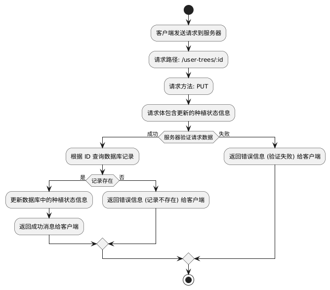
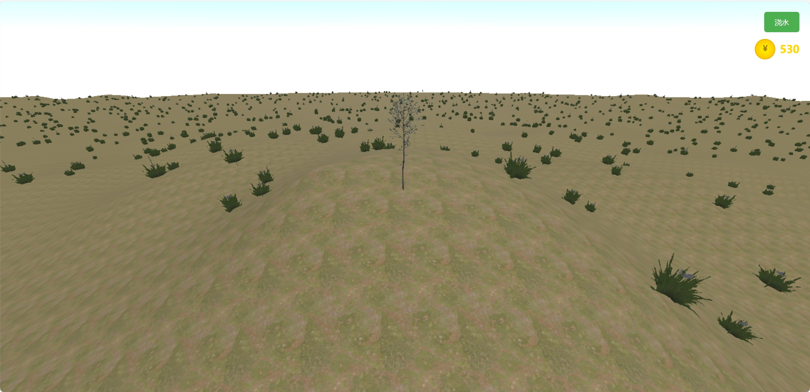

# 青青森林项目设计规约
## 1. 项目概述
### 1.1 项目背景

#### 1.1.1 项目起源

随着全球环保意识的提升，数字化环保教育成为了推动公众环保意识和行动的重要手段。传统的环保教育主要依赖于课堂讲解和阅读材料，但这些方式往往缺乏互动性和沉浸感，难以激发用户的参与热情。为此，青青森林项目应运而生，旨在通过现代Web技术和3D交互体验，结合虚拟种植与环保知识问答，为用户提供一个寓教于乐的环保学习平台。

项目的灵感来源于中国的蚂蚁森林，这个通过虚拟植树积攒能量的创新活动深受用户喜爱。青青森林项目不仅继承了蚂蚁森林的互动性和环保价值，还通过引入更为先进的3D技术，使得虚拟植树的过程更加生动、真实，增强了用户的参与感与成就感。

#### 1.1.2 环保教育的需求

近年来，全球气候变化和环境污染问题愈加严峻，许多国家和地区已经开始采取措施来应对这些挑战。与此同时，环保意识的普及成为了当务之急。尤其是年轻一代，他们是未来环保行动的主力军，但目前大多数环保教育还局限于传统形式，缺乏足够的互动和参与感。青青森林项目通过结合虚拟世界与现实环境，旨在填补这一教育空白，以更具吸引力和参与感的方式传递环保理念。

通过虚拟种树和环保知识问答，青青森林不仅帮助用户认识到生态保护的重要性，还鼓励他们从自己做起，通过日常小事为环境保护贡献力量。通过与树木和环境互动，用户能够更深刻地理解生态系统的脆弱性，并通过实际行动（如“浇水”、“种树”等）参与其中，这种深度参与有助于提升环保教育的实际效果。

#### 1.1.3 3D虚拟森林体验

传统的环保教育往往采用单一的2D图像或文字来展示环境和植物，虽然能传递一定的信息，但很难给人留下深刻的印象。青青森林项目的创新之处在于，采用了基于 **Three.js** 的3D图形渲染技术，为用户呈现一个真实的虚拟森林世界。在这个3D虚拟环境中，用户不仅可以与树木进行互动，还可以自由地探索不同的场景，观察树木的生长过程，并通过浇水、施肥等操作来促进树木的成长。

3D虚拟森林的沉浸式体验为环保教育注入了新的活力。它使用户能够从不同的角度和视角去理解自然界的复杂性，例如通过观察植物生长、了解不同环境下的树木如何适应变化的气候条件。这种体验式学习比传统教学方法更具吸引力，更能激发用户的学习兴趣和行动动力。

#### 1.1.4 项目定位与目标

青青森林项目的核心定位是一个 **环保教育平台**，通过虚拟植树、生态知识问答和互动游戏化设计，帮助用户提升环保意识，并激励他们参与到实际的环保行动中来。项目的目标是通过富有趣味性和互动性的方式，引导用户学习环保知识，同时增强他们的环保责任感。

具体来说，青青森林项目旨在：

- **提升环保意识**：通过虚拟森林的种树、浇水等互动操作，帮助用户更好地理解生态系统的平衡与脆弱性，并激励他们关注并参与到环境保护中来。
- **提供教育性内容**：通过环保知识问答，向用户普及环保基础知识，例如如何应对气候变化、如何保护生物多样性等。
- **增强用户体验**：通过沉浸式的3D交互体验，使得用户不仅在视觉上感受到自然环境的变化，还能在互动过程中体验到行动带来的成果和反馈，增强他们的学习动机。
#### 1.1.5 项目创新性

青青森林项目的创新之处不仅体现在技术层面，更体现在它如何将 **虚拟体验** 与 **环保教育** 深度结合。相比于传统的环保教育形式，青青森林项目通过**3D渲染技术**，为用户提供了一个沉浸式、互动性的学习平台，使得环保知识的传递变得更加直观和生动。用户不仅仅是通过阅读和学习环保知识，更是通过亲身参与虚拟植树、与环境互动等方式，加深对环保的理解和实践。

此外，项目还引入了**游戏化设计**元素，如金币系统和环保答题等，使用户在娱乐中学习，激发了他们的参与感和成就感。这种创新性的教育方式不仅能吸引环保意识较强的年轻群体，还能将环保教育的影响力扩展到更广泛的用户层。

#### 1.1.6 社会意义

随着全球环保问题日益严峻，更多的个人和组织开始意识到环保行动的必要性。青青森林项目作为一种新型的环保教育方式，能够触及到更多年轻人的环保意识，激发他们采取实际行动，帮助推进社会的可持续发展。通过这一平台，用户不仅学到了环保知识，还能通过自己的努力看到森林的变化，进而激发他们更加积极的环保行动。

### 1.2 核心功能

青青森林项目的核心功能涵盖了用户系统、3D场景系统、树木系统、互动系统等模块。通过这些功能，用户不仅能体验虚拟种树的过程，还能通过互动与场景探索深入了解环保知识。以下是项目的主要功能模块及其详细描述：

#### 1.2.1 用户系统

用户系统是青青森林的基础功能之一，旨在提供一个便捷的账户管理和个人化的虚拟森林空间。通过用户系统，用户可以管理自己的虚拟树木、查看成长进度、参与互动等。

- **用户注册与登录功能**：用户可以通过用户名和密码注册新账号，便于快捷登录和信息同步。提供用户认证，确保每个用户的数据安全。
- **个人森林空间管理**：每个用户都有独立的虚拟森林空间，用户可以在其中种植不同种类的树木、查看树木的生长状态，参与养护活动（如种植、浇水等）。用户可以在个人森林中切换树种，查看和互动自己种植的所有树木，体验成长的过程。
- **金币账户系统**：用户通过答题等方式获得金币。金币可以用于解锁新树种、购买虚拟物品（如进行浇水等）。金币系统不仅为用户提供了激励机制，还通过游戏化设计增强了用户的参与感和成就感。
#### 1.2.2 3D场景系统

3D场景系统是青青森林项目的视觉核心，旨在提供一个沉浸式的虚拟森林体验。用户可以在不同的环境下体验虚拟种植的乐趣，并且探索各种自然景观。

- **多样化地形场景（草地、山地、沙漠）**：项目提供三种地形场景，分别为草地（Grassland）、山地（Hill）和沙漠（Desert）。每种地形都有独特的植被、气候和环境特征。草地场景适合一般树木的生长，山地场景则适用于一些特定的植物，沙漠场景则主要展示耐旱植物的种植条件。
- **动态天气系统（晴天、多云、日落）**：场景中的天气系统支持实时变化，用户可以看到不同天气条件下环境的变化（如晴天的明亮光照、多云天气的柔和光线、日落时的温暖橙光等）。天气变化影响树木的生长状态与环境互动，增强了系统的互动性和动态感。
- **真实光照效果**：项目采用高质量的光照计算模型，模拟自然环境中的日光、阴影和反射等效果，增强用户的沉浸感。包括方向光、点光源、环境光等多个光源的搭配使用，使得场景更具真实感。
- **动态环境效果（鸟类等）**：引入动态生物元素，如飞翔的鸟类、自然界的植物等。鸟类的行为和飞行路径是动态的，能够与用户的互动产生联动效应。这些环境效果不仅美化场景，还增加了场景的生动感和互动性。
#### 1.2.3 树木系统

树木系统是青青森林项目的核心之一，通过树木的种植、成长和互动，用户能够更直观地感受到环境保护的重要性。树木系统的设计不仅考虑到视觉效果，还结合了教育意义和互动体验。

- **六种特色树木**：榕树、枫树、松树、大树、盆景、柳树等六种特色树木，每种树木具有独特的外观和生长特点。每种树木都有三个生长阶段，用户需要通过不断的浇水和照顾让树木从幼苗成长为大树。
- **生长阶段**：每种树木都分为三个生长阶段，从幼苗到成熟树木，用户可以通过浇水、施肥等方式促进树木的生长。生长过程中的视觉效果会随树木成长阶段的变化而发生不同的变化，增强用户的沉浸感和互动感。
- **浇水系统**：用户可以通过浇水按钮给树木浇水，帮助树木健康成长。浇水功能会触发水流效果，并产生相应的动画反馈。浇水功能是树木生长的关键因素之一，用户进行浇水操作后，树木会进行生长，变换形态。
- **树木摇摆效果**：在风的作用下，树木会产生轻微的摇摆效果，这种效果可以通过场景中的动态风力模拟。树木的摇摆不仅增加了视觉效果，还可以通过风力的变化让树木的表现更加生动。
#### 1.2.4 互动系统

互动系统是青青森林项目增强用户参与感的重要组成部分，用户可以通过不同的互动操作与虚拟环境产生联动，推动树木的生长，并获得金币奖励。

- **浇水功能**：通过花费金币，点击屏幕上的浇水按钮，用户可以进行浇水操作，促进树木的生长。每次浇水都会产生动态效果，如水壶倾倒、水流流动等，提升交互体验。
- **树木摇摆（风力效果）**：树木的摇摆效果不仅是视觉上的动态展示，还能让用户体验到自然界中风对植物的影响，增强环保教育的趣味性。
- **场景漫游**：用户可以自由控制视角，查看自己种植的虚拟森林，观察不同树木的生长状态。不同视角的自由查看的功能提升了用户的参与感，使其能够更好地感受虚拟森林的变化。
- **金币奖励**：用户通过参与环保答题可以获得金币奖励。金币可以用来购买树木成长所需的虚拟道具水壶进行浇水，也可以解锁新的树种和场景。游戏化设计的金币系统激励用户持续参与，增加了项目的娱乐性和教育性。
- **环保答题**：用户在项目中可以通过答题来获得金币奖励。答题内容涉及环保基础知识、气候变化、植物保护等，既增加了游戏的趣味性，也提升了用户的环保意识。
### 总结

青青森林项目的核心功能模块充分体现了教育性与娱乐性的结合。通过3D场景和树木系统，用户不仅可以获得沉浸式的虚拟植树体验，还能够在互动中学习环保知识。金币系统和游戏化设计进一步增强了用户的参与感和成就感，使项目既具备教育意义，又能吸引广泛的用户群体。

### 1.3 技术特色

青青森林项目采用了一系列现代Web技术，结合强大的3D图形渲染、交互设计和游戏化机制，旨在为用户提供一个沉浸式的环保教育平台。以下是项目的技术特色：

#### 1.3.1 3D渲染技术

青青森林项目的核心技术之一是其基于 **Three.js** 的高性能3D渲染系统。Three.js是一个开源的JavaScript库，用于在网页中渲染复杂的3D图形，广泛应用于网页游戏、虚拟现实（VR）和增强现实（AR）应用中。通过Three.js，青青森林能够实现高效且流畅的3D场景渲染。

- **高性能3D渲染**：使用 **WebGL** 和 **Three.js** 提供硬件加速的3D渲染效果，能够在不同平台和设备上保持高帧率和流畅的视觉体验。对3D模型进行了优化处理，以减少渲染负担，提高场景的流畅度，尤其是在复杂环境下仍能保证稳定的性能。
- **自适应场景缩放**：根据不同用户设备的性能，自动调整场景渲染的细节层级（LOD, Level of Detail）。例如，在高性能设备上，场景中的细节和纹理会更加精细，而在低性能设备上，渲染会进行适当的优化，以提高加载速度和流畅度。
- **流畅的动画效果**：使用 **requestAnimationFrame** 来驱动动画的帧更新，确保动画效果的平滑过渡，避免卡顿现象。动态天气、风力、树木生长等多种效果都能与用户的交互行为实时反馈，增强沉浸感和互动体验。
- **优化的模型加载系统**：为了提高加载速度，项目采用了按需加载和异步加载技术。树木模型、场景、纹理等资源会根据用户的需求动态加载，从而避免一次性加载过多资源导致的性能瓶颈。使用 **GLTF** 格式存储3D模型，较小的文件体积和快速加载速度使得场景加载更加高效。
#### 1.3.2 交互设计

青青森林项目致力于提供一种直观、响应迅速且易于使用的交互体验。项目结合了现代Web前端技术，设计了一套完整的交互控制系统，使得用户能够轻松与虚拟森林中的环境进行互动。

- **直观的用户界面**：界面采用简洁的设计风格，确保用户可以轻松找到所需功能。各种按钮、面板和信息显示区的位置设计合理，减少用户的学习成本。界面元素如按钮、状态提示、进度条等都进行了精细的设计，确保用户在进行浇水、答题、金币操作等时能够获得清晰的视觉反馈。
- **沉浸式的视觉体验**：青青森林可以在常规浏览器中运行，通过3D界面，为用户提供更加沉浸的互动体验。在3D场景中，用户不仅能看到树木的成长，还能与环境中的鸟类、风力等自然元素互动，增强了环境感知和参与感。
- **实时反馈机制**：用户与系统的互动都会有即时反馈。例如，浇水按钮点击后，会触发相应的动画，树木的生长状态也会随之更新。这样做的目的是让用户感受到自己行为的影响，从而增加用户的参与感和成就感。
#### 1.3.3 游戏化设计

青青森林项目采用了 **游戏化设计**（Gamification）理念，结合教育性和娱乐性，鼓励用户通过游戏化的方式进行环保教育。

- **成长系统：树木分级成长**：树木的成长通过多个阶段表现，用户可以通过浇水、施肥等操作让树木从幼苗成长为成熟的大树。每个阶段都有不同的视觉效果和成长提示，增强用户的成就感。通过树木的成长，用户可以体验到“养育”的乐趣，这种互动式的学习方式提高了教育效果。
- **奖励机制：环保知识问答**：用户可以通过参与环保知识问答来获得金币奖励。问答内容包括气候变化、能源节约、生物多样性等环保主题，既有趣又富有教育意义。奖励机制不仅增强了用户的参与动机，也帮助他们掌握环保相关知识，同时使得整个项目具有一定的教育功能。
- **收集系统：多样化树种**：用户可以解锁多种树木，每种树木代表一种不同的植物和生长环境。树木的种类和生长过程也是用户成长的标志，激励他们不断参与和探索。随着用户的参与，更多树木品种、场景、道具等都会逐步解锁，形成一个丰富的虚拟世界。
- **互动玩法：浇水等养护操作**：用户在青青森林中不仅可以种植树木，还可以进行其他养护操作，如进行浇水。通过花费金币浇水，树木的可以进行成长，完成生长状态和外形的切换。这种互动玩法鼓励用户在不同的情境下进行探索，从而培养他们对环保的兴趣和责任感。
#### 1.3.4 性能优化与兼容性

为了确保青青森林项目在各种设备上都能流畅运行，团队采用了多种性能优化技术。

- **资源加载优化**：采用 **懒加载** 和 **按需加载** 技术，只在用户需要时才加载资源，减少页面初始加载时间。模型、纹理和音效等资源会在后台预加载，确保用户体验不会因资源加载而受到影响。
- **内存管理与垃圾回收**：通过合理的内存管理和资源清理机制，确保在场景切换或用户操作过程中，未使用的资源能够及时释放，避免内存泄漏和性能下降。
- **多平台兼容性**：该项目采用 **WebGL** 和 **Three.js**，确保在不同的浏览器中均能兼容运行，支持现代浏览器如Chrome、Firefox、Safari等。通过兼容性测试，确保不同操作系统（Windows、Mac、Linux）和设备（PC、手机、平板）上都能有一致的体验。
### 总结

青青森林项目通过 **Three.js** 和现代Web技术，结合强大的图形渲染和交互设计，为用户提供了一个流畅且沉浸的虚拟森林体验。游戏化设计增强了项目的趣味性和教育性，确保用户不仅能够享受游戏的乐趣，还能学习到环保知识。项目的性能优化和多平台兼容性确保了广泛的用户群体能够顺利体验这一虚拟世界。

### 1.4 项目价值

青青森林项目不仅是一个创新的3D虚拟平台，更是一个具有深远社会意义和教育价值的环保教育工具。通过结合现代Web技术、游戏化设计与环保教育理念，青青森林为用户提供了一个既有趣又富有教育意义的互动环境，推动着环保意识的普及与社会责任感的提升。以下是青青森林项目的核心价值体现：

#### 1.4.1 提升环保意识

青青森林项目的核心目标之一是通过虚拟植树活动提升用户的环保意识。随着全球环保问题的日益严重，公众对环境保护的关注不断增强，特别是年轻一代对于环保的重视也在逐步增加。通过虚拟植树和互动游戏，青青森林让用户在愉快的体验中感知到环境保护的重要性。

- **沉浸式体验**：通过虚拟森林中的树木成长、动态天气变化等自然元素，用户能够身临其境地感受到生态系统的脆弱与复杂性，增强了环保的感知力。
- **互动教育**：用户不仅在虚拟世界中进行植树、浇水等养护操作，还通过环保知识问答和任务系统了解气候变化、生物多样性等环保话题，强化环保意识。
- **行为引导**：通过互动和成长系统，用户可以观察自己的环保行为（如种树、浇水）对环境的正向影响，激励他们在现实生活中践行环保。
#### 1.4.2 教育意义

环保教育是青青森林项目的重要组成部分。通过结合游戏化设计与互动式学习，项目为用户提供了一个寓教于乐的学习平台。无论是青少年还是成人，都可以在这里轻松学习到环保相关知识，并形成正确的环保价值观。

- **知识普及**：项目通过设置环保知识问答、任务挑战等方式，将气候变化、绿色能源、垃圾分类、物种保护等环境保护知识与用户的日常活动紧密结合，帮助用户更好地理解和掌握这些知识。
- **情境模拟**：通过虚拟种树和环境互动，青青森林将复杂的生态和环保问题转化为用户可理解、可操作的互动形式。用户在虚拟世界中学到的环保知识，能更好地转化为现实生活中的行动。
- **跨年龄段教育**：该项目的设计适应不同年龄段的用户需求。对于年轻人，游戏化的设计能引发他们的兴趣，让他们以轻松愉快的方式了解环保；对于成年人，树木生长的管理和环保答题更具深度，帮助他们形成更强的环保责任感。
#### 1.4.3 社交互动

青青森林项目不仅注重个人学习和成长，还通过社交互动功能增强用户之间的连接和合作，促进环境保护意识的群体传播。

- **虚拟森林参观与互动**：用户可以访问朋友的虚拟森林，观看他们种植的树木，甚至与其他用户共享树木养护的技巧或游戏成就。这种社交互动不仅增加了项目的趣味性，还激励用户参与到更多的环保活动中。
- **团队合作与竞赛**：通过虚拟森林参观、竞赛任务等功能，青青森林促进了用户之间的协作与竞争，激发了集体的环保行动力。例如，团队可以一起完成环保任务，或者在答题挑战中与朋友竞争环保知识。
- **环保行动的集体效应**：通过社交功能，用户可以分享自己的环保行为，如植树成果、浇水次数等，进而激发更多用户参与到环保行动中。这种集体效应有助于加强环保行为的社会认同感和行动力。
#### 1.4.4 技术创新

青青森林项目采用了最前沿的Web技术和3D渲染技术，确保了项目在技术层面的创新性和可行性。项目的技术架构和设计方案，展示了数字化环保教育的新模式，体现了Web技术在环保教育领域的巨大潜力。

- **WebGL与Three.js技术**：通过利用WebGL和Three.js，青青森林为用户提供了流畅且高效的3D虚拟体验。3D场景渲染和动画效果的实现，极大地提升了用户的视觉和交互体验，使得环保教育不再局限于文字和图片，而是融入了沉浸式的虚拟环境。
- **游戏化设计与互动性**：将环保教育内容通过游戏化设计展现给用户，提供了更加轻松、有趣的学习方式。金币系统、树木成长、任务挑战等游戏化元素不仅增强了项目的娱乐性，也让环保教育变得更加富有互动性和参与感。
- **响应式设计与跨平台兼容性**：青青森林的设计兼顾了不同设备和平台的兼容性，支持桌面端、移动端及虚拟现实设备的使用，确保了项目的普适性和可扩展性。
#### 1.4.5 社会责任与可持续发展

青青森林项目不仅仅是一个虚拟游戏，它还承载着更深远的社会责任。通过虚拟森林的植树活动，项目积极响应全球可持续发展的呼吁，鼓励用户通过娱乐的方式参与到环保和自然保护的事业中。

- **推动社会责任感**：通过参与虚拟种树、环保答题和其他互动操作，青青森林让用户从虚拟世界中感知到环境保护的重要性，从而激发他们在现实生活中的行动力。
- **生态平衡与可持续发展**：通过模拟不同生态环境下的植物生长，青青森林帮助用户理解自然界的生态平衡与可持续发展问题。项目鼓励用户关注全球生态环境，并通过实际行动促进自然资源的保护和合理利用。
- **普及绿色生活理念**：通过环保答题、植物养护、生态互动等功能，青青森林帮助用户更深入地理解绿色生活理念，鼓励他们在日常生活中采取节能、环保的行为，如减少碳排放、节约用水、保护生物多样性等。
#### 1.4.6 促进可持续绿色经济

青青森林项目还通过与绿色经济相关的内容，推动了可持续绿色经济的发展。项目通过虚拟种树和环保知识传播，帮助用户了解绿色经济和可持续发展的基本概念。

- **倡导绿色消费**：通过项目中的树木生长系统、环保答题等功能，青青森林传递了绿色消费、低碳生活等理念，鼓励用户在实际生活中选择环保产品和服务，推动绿色产业的发展。
- **支持绿色技术**：项目本身的技术架构，尤其是基于Web的3D渲染技术，为其他绿色技术的应用提供了参考和支持。青青森林展示了如何将新兴技术与环保教育结合，为环保事业注入技术创新的动力。
### 总结

青青森林项目的核心价值体现在其对环保意识的提升、教育意义的深远、社交互动的推动、技术创新的展示以及社会责任的履行等多个方面。通过创新的虚拟植树体验和游戏化设计，青青森林不仅让用户在轻松愉快的互动中学习环保知识，还通过集体效应和社交互动激励更多人参与到环境保护中来。此外，项目的技术特色和跨平台兼容性使其成为数字化环保教育领域的先锋。通过这个项目，青青森林不仅仅是一个虚拟森林，更是一个培养环保责任感和社会责任感的桥梁，推动着全球可持续发展目标的实现。

## 2. 系统架构

### 2.1 系统架构图
系统架构图如下，展示了青青森林项目的整体系统架构，分为用户层、前端层、后端层和数据库层四个部分，各层职责分工明确，协同实现项目的功能，该架构图展示了从用户界面到数据库的整个数据流和处理流程。前端通过与 API 接口的交互完成数据获取和更新，而后端则通过数据库存储和查询必要的数据，从而支撑整个虚拟森林项目的运行：  
  
具体设计如下：
1. **用户层**
  - 用户通过**Web浏览器**访问系统，浏览器作为用户与前端交互的主要工具，发送用户的操作请求并显示返回的数据。

2. **前端层**
  - 前端主要采用 **HTML/CSS/JavaScript** 技术栈实现，使用 **Three.js** 作为核心框架，渲染3D场景和模型。
  - 包含两大功能：
    - **前端框架 (Three.js)**：用于创建虚拟森林的3D场景，负责渲染树木、场景模型以及与用户的互动效果。
    - **交互逻辑 (JavaScript)**：负责管理用户界面的交互逻辑，包括树种选择、答题、种植操作及金币奖励等行为。
  - 用户所有的操作都会被封装为HTTP请求，通过API接口发送到后端处理。

3. **后端层**
  - 后端基于 Node.js 的 Express.js 框架开发，实现系统的业务逻辑处理。
  - 包含三大核心组件：
    - **路由管理**：负责分发用户的请求到具体的API接口。
    - **RESTful API**：定义和处理用户操作接口，支持获取树木信息、管理用户状态、答题奖励等功能。
    - **后端业务逻辑**：实现关键功能，比如树木种植状态管理、用户金币更新和环保题目校验等。
  - 后端以API的形式为前端提供服务，将前端请求的数据从数据库中提取、计算后返回，或对数据库执行写入操作。

4. **数据库层**
  - 使用 MySQL 作为数据库管理系统，持久化存储系统的关键数据。
  - 数据表设计如下：
    - **users 表**：存储用户信息，包括用户名、密码、金币余额等。
    - **trees 表**：记录树种的基本种类。
    - **user_trees 表**：保存用户与其种植树木之间的状态数据，比如生长阶段、种植与否等。
    - **questions 表**：存储环保相关的题库，用于支持答题模块。

5. 整体逻辑说明  
用户通过浏览器进行操作请求，经前端的交互逻辑处理后，通过标准化的RESTful API与后端交互，后端根据业务逻辑操作数据库或返回必要数据，从而完成3D场景中的树种展示与更新、金币奖励及环保问答等核心功能。  
该架构遵循分层设计原则，具备高扩展性和高可维护性，是项目实施的关键技术基础。

### 2.2 包图
下图展示了青青森林项目的整体包结构设计。通过前端、后端、数据库和资源模块的划分，该架构实现了系统功能的模块化、解耦化，并支持清晰的职责分工和功能扩展性。  


具体设计如下：

1. **前端模块**
  - 前端分为**3D模型渲染模块**和**项目界面模块**：  
    - **3D模型渲染模块**：负责管理和渲染树木及场景模型，以及用户交互动画效果。模块从Resources的模型资源包中获取渲染所需的静态资源，确保 3D 场景的高效加载与显示。
    - **项目界面模块**：包括用户登录、答题界面、树种选择界面等子模块，主要承担用户操作入口的逻辑展示与调用后端服务。

2. **后端模块**
  - 后端服务主要负责支持前端操作的业务逻辑，包括用户管理、树木管理、金币管理以及环保知识题目的处理：
    - **用户服务**：处理用户的登录注册、个人信息查询及更新。
    - **树木服务**：支持用户种植与管理树木的状态数据，例如种植状态和生长阶段。
    - **环保题目服务**：提供环保知识问答，处理用户的答案验证，并为正确回答的用户分配金币奖励。
    - **金币服务**：专门负责用户金币余额的增减操作，支持消费与奖励的场景。

3. **数据库模块**
  - 数据库层为后端模块提供了持久化的数据支持：
    - **用户数据表**：存储用户的用户名、密码及金币余额。
    - **树木数据表**：记录树木的种类。
    - **用户种植数据表**：记录树木的生长阶段
    - **环保题库表**：存储与环保相关的问答题目，及答案，用于支持用户答题功能。

4. **资源模块**
  - 模型资源模块是系统中特殊的一部分，用于存储 3D 场景渲染所需的静态资源，包括树木模型和场景模型。这些资源通过前端 3D模型渲染模块 进行加载和展示，是实现沉浸式体验的基础。

5. **模块间依赖**
  - 前端模块通过标准接口与后端交互，请求数据或提交用户操作，如答题、购买树种等。  
  后端模块通过数据库与模型资源协作，统一管理项目数据和静态资源。

这种架构设计清晰地划分了每个模块的职责，具备较高的可扩展性和维护性。随着项目的功能扩展，该架构可以很容易地新增或替换独立模块而不影响整体系统的运行。

### 2.3 项目部署


青青森林项目的部署结构由三个核心节点组成，分别是Web客户端、应用服务器和数据库服务器。这些节点通过HTTP和SQL协议进行通信，协同完成前端渲染、业务逻辑处理和数据存储管理，以支持用户进行树木种植、金币管理和答题交互等功能。
Web客户端节点是用户访问系统的入口，运行在用户的浏览器环境中。它主要负责加载和渲染HTML页面，并通过JavaScript提供动态交互功能。Web客户端通过HTTP协议与应用服务器通信，发送用户操作请求并接收服务器返回的数据。前端使用three.js库渲染3D模型和动画场景，为用户提供丰富的视觉体验和交互功能。此外，Web客户端还加载静态资源，如CSS样式表、JavaScript脚本和图片文件，确保界面布局和交互效果的一致性与美观性。用户在客户端进行的操作，如登录、种树、浇水和答题等，都通过HTTP请求传递给应用服务器进行处理，客户端会实时获取服务器返回的结果并更新界面显示。
应用服务器节点运行Node.js环境，承担业务逻辑处理和静态资源管理的任务。Node.js应用程序负责解析Web客户端发来的请求，并执行相应的业务逻辑，如用户注册登录验证、金币交易和树木状态管理等功能。应用服务器通过RESTful API接口处理前端请求，并根据操作需求与数据库服务器进行数据交互。在静态资源管理方面，应用服务器存储3D模型和图片资源，并将这些资源提供给客户端进行加载和渲染。Node.js的非阻塞I/O机制确保服务器可以同时处理大量请求，适合青青森林项目的高并发场景需求。应用服务器还通过日志记录和错误处理模块监控系统运行状态，保证服务的稳定性和可维护性。
数据库服务器节点负责存储和管理系统的核心数据，包括用户信息、金币余额、种植记录和题库数据。数据库采用关系型数据库（如MySQL）进行部署，通过SQL语句与应用服务器通信。应用服务器将用户请求转换为SQL查询或更新操作，向数据库存储或检索数据，并将查询结果返回给客户端。数据库中的持久数据包括用户账户和登录凭证、金币交易历史、树木成长状态以及答题记录等关键内容，支持系统功能的正常运行。数据库服务器还配置了访问控制和数据加密机制，以保护用户隐私和敏感数据的安全性。同时，为保障数据一致性和可靠性，数据库定期进行备份，防止数据丢失或损坏。
整个部署架构采用客户端-服务器模式，客户端负责用户界面交互和资源加载，应用服务器负责业务逻辑和静态资源管理，数据库服务器负责数据存储和查询。客户端与应用服务器之间通过HTTP协议通信，应用服务器与数据库服务器之间通过SQL语句进行数据交互。这种设计确保了系统功能模块的分工明确，便于开发和维护，同时也支持未来的扩展需求。
系统的通信流程从Web客户端发起请求开始，客户端将用户输入的数据（如登录信息或操作指令）通过HTTP协议发送到应用服务器。应用服务器根据请求解析并执行对应的业务逻辑，如果需要查询或更新数据，则进一步向数据库服务器发送SQL查询。数据库服务器处理SQL语句后将结果返回给应用服务器，应用服务器再将处理结果以HTTP响应的形式发送回客户端。客户端接收结果后，更新界面或执行进一步操作，形成一个完整的交互闭环。
这种部署结构充分利用Node.js的非阻塞I/O特性，确保高并发请求的处理效率，同时借助关系型数据库管理复杂的数据存储需求，为系统提供稳定性和可靠性保障。由于所有服务均部署在同一服务器上，该架构适合初期小规模用户访问需求，且保留了未来升级为分布式部署的扩展空间。例如，可以通过负载均衡器分发流量，将应用服务器与静态资源管理模块拆分到多个服务器上，提高系统的扩展性和性能。
青青森林的部署方式结合了前端three.js框架与后端Node.js应用程序，并通过MySQL数据库支撑核心数据管理。整体架构采用模块化设计，便于后期功能扩展和维护，同时通过HTTP和SQL协议实现高效的通信机制，保证系统运行的流畅性和互动体验。这种部署结构兼具灵活性与稳定性，能够满足当前功能需求，并为未来用户增长和功能扩展提供良好的基础支持。

### 2.4 前端架构

青青森林项目的前端架构采用现代Web技术栈，结合了高效的3D渲染引擎、流畅的用户交互系统、响应式设计和模块化开发等特点，确保能够提供流畅、稳定且易于扩展的用户体验。前端架构的核心目标是实现跨平台的兼容性，同时保持灵活性和性能优化，以适应不同设备和用户需求。以下是青青森林项目前端架构的详细设计：

#### 2.4.1 核心技术栈

青青森林的前端技术栈选用了当前Web开发领域的主流技术，确保项目具有较高的可维护性和性能。

- **Three.js**：用于3D图形渲染，支持WebGL，提供了强大的3D建模、光照、材质、动画等功能，能够实现虚拟森林中的高质量场景渲染和动态效果。Three.js作为核心的渲染引擎，支持各种3D交互和视觉效果。
- **JavaScript/ES6+**：作为项目的主要开发语言，使用JavaScript（ES6及以上版本）开发前端逻辑。ES6的引入提高了代码的可读性和开发效率，尤其在异步操作（如API请求、动画渲染等）方面，提供了更清晰和高效的语法结构（如Promises、async/await等）。
- **HTML5/CSS3**：用于页面结构和样式的设计，HTML5提供了更丰富的标签和API（如`<canvas>`、`<video>`等），而CSS3则为项目提供了灵活的布局、动画效果和响应式设计支持。
- **WebGL**：在Three.js的基础上使用WebGL进行硬件加速的3D图形渲染。WebGL作为Web平台上最基础的图形渲染API，能够在浏览器中高效地绘制3D图形，并支持丰富的图形效果，如光照、阴影、透明度、纹理等。

#### 2.4.2 模块化设计

为了确保前端代码的高可维护性和可扩展性，青青森林项目采用了模块化设计的开发思路。前端代码被分为多个独立的模块，每个模块负责不同的功能或逻辑，模块之间通过清晰的接口进行交互。具体模块包括：

- **场景管理模块**：
  - **地形系统**：负责加载和渲染不同类型的地形（如草地、山地、沙漠等），并根据场景需要进行动态调整。地形模块处理地形的细节（如高度、纹理、植被等）和动态变化（如天气变化、植物成长等）。
  - **天空系统**：处理不同天气效果（如晴天、多云、日落等），通过动态的光照和背景图像来实现不同的天空状态。天空系统的实现需要与场景中的光照效果密切配合。
  - **生物系统**：负责在虚拟森林中添加动态生物（如鸟类），通过动画和行为逻辑使这些生物能够与用户的操作产生交互，如飞行路径。
  - **特效系统**：如水流、风力、粒子效果等，用于增强场景的沉浸感。例如，浇水特效、树木摇摆特效等都属于特效系统的范畴。
- **树木管理模块**：  
负责加载树木模型并控制树木的生长状态。树木的生长阶段、浇水、施肥等操作都会在此模块中进行管理。每种树木都有不同的模型、材质和动画效果，树木管理模块会根据用户的操作和树木的生长进度动态更新树木的显示和状态。
- **交互控制模块**：
  - **相机控制**：处理用户与场景的交互，包括视角的移动、旋转、缩放等操作。通过引入OrbitControls等控制库，实现用户对虚拟森林的自由探索。
  - **用户输入处理**：包括鼠标点击、键盘操作、触摸事件等，响应用户的交互操作，如浇水按钮点击、树木选择等。
  - **碰撞检测**：处理场景中的物体与用户之间的交互，确保用户操作时的正确性和交互流畅性。
- **动画系统模块**：  
负责所有动画的更新和管理，包括树木的生长、风力对树木的影响、浇水效果、用户视角的平滑过渡等。动画模块通过 **requestAnimationFrame** 控制帧率，并结合 **Three.js** 提供的动画系统来处理物体的运动、转动、颜色变化等动画效果。
- **UI组件模块**：  
用于处理用户界面上的所有交互元素，如按钮、菜单、提示框等。每个UI组件都封装成独立模块，确保界面元素的可复用性和可维护性。例如，浇水按钮、金币显示、任务面板等都属于UI组件模块的范畴，UI组件模块负责组件的样式、功能和交互。
#### 2.4.3 场景渲染架构

场景渲染架构是前端架构中最重要的一部分，负责渲染所有3D元素，并确保它们在用户界面中的正确显示和动态更新。青青森林项目的场景渲染架构主要包括以下几个方面：

- **场景初始化**：使用 **Three.js** 创建和初始化场景对象 (THREE.Scene)，并设置基本的场景属性，如光照、背景色、渲染器等。设置主摄像机（THREE.PerspectiveCamera）并配置其视角、近远剪裁面和宽高比。
- **相机系统配置**：通过相机控制器（如 **OrbitControls** 或 **TrackballControls**）来管理用户视角的运动和旋转。用户可以自由控制视角，观察虚拟森林中的树木生长情况、天气变化等。视角控制系统还需要考虑最小和最大高度、缩放限制等因素，确保用户在游览时不发生不适的视角变化。
- **光照系统设置**：设置 **DirectionalLight**（主光源）和其他光源（如点光源、环境光等）来模拟自然光照效果。光照的变化需要根据场景中的天气状态和时间变化来调整。根据不同时间的天气变化（如白天、日落等），调整光照的强度和颜色，增强环境的真实感。
- **地形环境生成**：根据不同的场景（如草地、山地、沙漠等），生成不同的地形和背景。地形系统包括地面、植被和其他自然元素（如水池、山脉等）。地形模块使用高度图和纹理贴图来生成真实的地表面，支持动态变化（如草地上长出新植物、沙漠中出现绿洲等）。
- **天空盒加载**：通过 **THREE.CubeTextureLoader** 加载天空盒纹理（包含多个方向的天空图像），模拟真实的天空背景。根据不同的天气变化，调整天空盒的显示内容和光照强度。
- **渲染循环系统**：通过 **requestAnimationFrame** 实现持续的渲染循环，更新场景中的物体、动画、特效等元素，并进行渲染输出。每次渲染前，都会先更新场景中的物体状态（如树木的生长、天气的变化等）。
- **动画更新**：动画系统将通过 **Three.js** 提供的动画控制器更新每个场景物体的动画状态。例如，树木生长动画、浇水特效动画、树木摇摆等都会通过该系统进行动态更新。
- **性能优化**：为了确保流畅的用户体验，场景渲染会进行性能优化，例如使用 **LOD（Level of Detail）** 技术减少远处物体的渲染负担、减少多余的渲染调用等。
- **事件处理**：事件处理系统负责捕捉和处理用户的输入事件，如鼠标点击、触摸滑动等，确保用户与虚拟森林的互动流畅且精确。
### 总结

青青森林项目的前端架构充分考虑了3D渲染、交互设计、性能优化和模块化开发等因素，通过合理的技术选型和架构设计，确保了项目在不同设备和平台上的高效运行。场景渲染架构与各个模块的功能紧密配合，使得用户能够在沉浸式的虚拟森林中自由探索、互动，享受环保教育与娱乐的完美结合。

 ### 2.5 后端架构

青青森林项目的后端架构基于 **Node.js** 和 **MySQL** 数据库，使用 **Express.js** 框架搭建 RESTful API 服务，并利用中间件进行请求处理和跨域支持。后端架构简洁高效，能够支持项目的基本数据存储和交互需求。以下是对青青森林后端架构的详细介绍：

#### 2.5.1 服务器架构

后端服务使用 **Node.js** 来搭建，采用 **Express.js** 框架提供强大的路由管理和中间件支持。Node.js 是一个基于 Chrome V8 引擎的 JavaScript 运行时，适用于处理高并发的 I/O 密集型应用，能够满足青青森林项目对实时互动和高效数据交换的需求。

- **Node.js**：利用 Node.js 的异步非阻塞 I/O 特性，后端能够在处理大量并发请求时保持高效性能，特别是在实时数据交换和用户互动时具有明显优势。
- **Express.js**：作为一个轻量级的 Web 框架，Express 提供了路由管理、中间件支持和错误处理等功能，帮助后端开发快速搭建服务端应用。
- **CORS（跨域资源共享）**：后端启用了 **CORS** 中间件，允许来自不同源的请求访问该 API，确保前端应用在开发和生产环境下能够无障碍地访问后端资源。
#### 2.5.2 数据库设计

后端使用 **MySQL** 作为数据库管理系统，通过 **mysql2** 连接库与数据库进行交互。数据库结构主要围绕用户、树木、金币等核心数据展开，确保系统可以高效地存储和检索必要的数据。

- **MySQL**：MySQL 是一个关系型数据库管理系统，支持高效的数据查询和事务处理。它能够提供数据一致性和完整性，适合青青森林这样需要处理用户信息、树木状态、金币等多个数据表的项目。
- **数据库表结构**：**users**：存储用户的基本信息，如用户名、密码、金币数量等。**trees**：存储树木的种类信息，包括树木名称、模型路径、成长阶段等。**user_trees**：存储每个用户种植的树木信息，包括用户 ID、树木 ID、是否已种植以及树木的成长阶段。**questions**：存储环保答题的题目、选项和正确答案，用于用户答题活动。
- **数据库连接配置**：使用 MySQL 数据库连接池来保证对数据库的高效访问和连接管理。连接池能够减少频繁创建数据库连接的开销，提高系统性能。
#### 2.5.3 核心服务模块

后端提供了多个核心服务模块，每个模块处理不同的业务逻辑，如用户管理、树木管理、金币管理等。每个服务模块都通过 RESTful API 提供访问接口，前端可以通过 HTTP 请求与后端进行交互。

1. **用户服务（User Service）**：
- **注册与登录**：用户可以通过用户名和密码注册或登录，后端验证用户名和密码的正确性，返回相应的登录状态。
- **获取用户信息**：可以通过 GET /users/:id 接口获取特定用户的基本信息（如金币数量、用户名等）。
- **更新金币数量**：提供金币增减接口，用户在完成环保答题等任务后可以通过 PUT /users/:id/coins 接口更新金币。
2. **树木服务（Tree Service）**：
- **获取树木列表**：通过 GET /trees 接口获取系统中所有树木的种类及其详细信息（如树木名称、模型路径、成长阶段等）。
- **用户树木管理**：提供 GET /user-trees/:userId 接口查看某个用户种植的树木信息。用户可以查询到哪些树木已经种植，并且获取到每棵树的生长阶段。
- **添加用户树木**：通过 POST /user-trees 接口添加用户种植的树木信息。后台检查该树是否已种植，防止重复种植。
- **更新树木状态**：通过 PUT /user-trees/:id 接口更新某棵树的种植状态或生长阶段，前端通过此接口与后端同步用户操作。
3. **金币服务（Coins Service）**：
- **查询金币数量**：通过 GET /users/:id/coins 查询用户当前的金币数量。
- **增加/减少金币**：通过 PUT /users/:id/coins 接口实现用户金币的增加或减少，例如完成环保答题后用户获得金币奖励。
4. **算法题目服务（Questions Service）**：
- **获取随机题目**：通过 GET /question 获取一个随机的环保题目，用户可以在系统中进行环保知识答题。
- **验证答案并更新金币**：通过 POST /answer 验证用户的回答，并根据回答结果增加或减少金币。
#### 2.5.4 路由与请求处理

后端服务通过 Express.js 路由来处理不同的请求。每个请求对应一个 API 接口，前端可以通过 HTTP 请求调用后端服务，获取数据或提交数据。

- **GET 请求**：用于查询资源，如获取用户信息、树木种类、题目等。例如，`GET /users/:id/coins` 用于查询用户的金币数量。
- **POST 请求**：用于创建新资源或提交数据，如用户注册、用户答题提交等。例如，`POST /users` 用于创建新用户，`POST /answer` 用于提交用户答题结果。
- **PUT 请求**：用于更新资源，如更新用户金币数量、更新树木状态等。例如，`PUT /user-trees/:id` 用于更新用户种植的树木的状态。

#### 2.5.5 启动与监控

后端应用通过 `node server.js` 启动，监听指定端口（如 3008），并等待客户端请求。服务器启动后，会向控制台输出“服务器加载成功”信息，表示后端服务已正常运行。

- **端口设置**：项目使用了 **3008** 端口来监听前端请求，确保与其他系统服务的端口不冲突。
- **日志记录**：使用 `console.log()` 输出一些关键操作的日志，如数据库连接成功、错误日志等，帮助开发者和运维人员监控后端服务的运行状态。
#### 总结

青青森林项目的后端架构以 **Node.js** 和 **MySQL** 为核心，通过 **Express.js** 提供高效的 RESTful API 服务。后端系统负责用户管理、树木种植、金币管理、环保答题等核心业务功能，通过路由和中间件高效处理各种请求。数据库设计合理，能够存储用户信息、树木状态、金币数据等多种核心内容，确保系统的稳定性和数据一致性。同时，后端在安全性方面也采取了适当的措施，保护用户数据的安全和隐私。

## 3 数据库设计
#### 3.1 数据库概述

项目的数据库设计包含以下核心部分：

- 用户数据存储
- 树种类数据存储
- 用户种植数据存储
- 环保知识问答题目存储
数据库采用关系型结构，所有表之间通过外键建立关联，确保数据的一致性和完整性。

#### 3.2 数据库表设计
项目的数据库表ER关系图如下：  


##### 1. users 表 - 用户表

用于存储平台的所有用户信息，包括用户名、加密后的密码、金币余额等。

**字段说明：**

- id：用户的唯一标识，主键，自动递增。
- username：用户的用户名，最大长度 50，唯一。
- password：用户的密码，存储加密后的密码，最大长度 255。
- coins：用户的金币数量，默认值为 0。

**建表语句：**
```sql
CREATE TABLE users (
    id INT AUTO_INCREMENT PRIMARY KEY,          -- 用户唯一标识
    username VARCHAR(50) NOT NULL UNIQUE,       -- 用户名
    password VARCHAR(255) NOT NULL,             -- 用户密码（建议存储加密值）
    coins INT DEFAULT 0                         -- 用户金币数量
);
```
**users 表**：


##### 2. trees 表 - 树种类表

用于存储系统中的所有树木种类信息，每种树木有一个唯一的名称。

**字段说明：**

- id：树种类的唯一标识，主键，自动递增。
- tree_name：树木名称，最大长度 100，唯一。

**建表语句：**
```sql
CREATE TABLE trees (
    id INT AUTO_INCREMENT PRIMARY KEY,          -- 树种类唯一标识
    tree_name VARCHAR(100) NOT NULL UNIQUE      -- 树名称
);
```
**trees 表**：


##### 3. user_trees 表 - 用户种植情况表

用于存储每个用户所种植的树木信息，包括树木种类、种植状态、生长阶段等。

**字段说明：**

- id：记录的唯一标识，主键，自动递增。
- user_id：关联用户的 ID，外键引用 users 表的 id 字段。
- tree_id：关联树木的 ID，外键引用 trees 表的 id 字段。
- is_planted：树木是否已被种植，布尔值（默认 FALSE）。
- growth_stage：树木的生长阶段，整数值（0：未开始，1：初始，2：中期，3：成熟）。

**建表语句：**
```sql
CREATE TABLE user_trees (
    id INT AUTO_INCREMENT PRIMARY KEY,          -- 唯一标识
    user_id INT NOT NULL,                       -- 用户 ID
    tree_id INT NOT NULL,                       -- 树种类 ID
    is_planted BOOLEAN DEFAULT FALSE,           -- 是否种植
    growth_stage INT DEFAULT 0,                 -- 生长阶段（0: 未开始, 1: 初始, 2: 中期, 3: 成熟）
    FOREIGN KEY (user_id) REFERENCES users(id), -- 关联用户表
    FOREIGN KEY (tree_id) REFERENCES trees(id)  -- 关联树种类表
);
```
**user_trees 表**：


##### 4. questions 表 - 题目表

用于存储环保知识问答的题目信息，每个题目包括题目内容、选项和正确答案。

**字段说明：**

- id：题目的唯一标识，主键，自动递增。
- question_text：题目内容，最大长度 255。
- option_a：选项 A，最大长度 100。
- option_b：选项 B，最大长度 100。
- option_c：选项 C，最大长度 100。
- option_d：选项 D，最大长度 100。
- correct_option：正确选项，使用字符类型（A, B, C, D）。

**建表语句：**
```sql
CREATE TABLE questions (
    id INT AUTO_INCREMENT PRIMARY KEY,          -- 题目唯一标识
    question_text VARCHAR(255) NOT NULL,        -- 题目内容
    option_a VARCHAR(100) NOT NULL,             -- 选项A
    option_b VARCHAR(100) NOT NULL,             -- 选项B
    option_c VARCHAR(100) NOT NULL,             -- 选项C
    option_d VARCHAR(100) NOT NULL,             -- 选项D
    correct_option CHAR(1) NOT NULL             -- 正确选项（A, B, C, D）
);
```
**questions 表**：


#### 3.3 数据插入示例

以下是插入用户、树种类和题目的示例数据：

##### 插入用户数据

```sql
INSERT INTO users (username, password, coins) VALUES
('user1', 'password1', 100),
('user2', 'password2', 200);
```

##### 插入树种类数据

```sql
INSERT INTO trees (tree_name) VALUES
('榕树'),
('枫树'),
('松树'),
('大树'),
('盆景'),
('柳树');
```

##### 插入题目数据

```sql
INSERT INTO questions (question_text, option_a, option_b, option_c, option_d, correct_option) VALUES
('我国是世界第( )大能源消费国。', '一', '二', '三', '四', 'A'),
('目前我国受污染的河流比例达到( )。', '80%', '85%', '90%', '92%', 'C');
```

#### 3.4 外键与数据完整性

- user_trees 表中的 user_id 和 tree_id 字段通过外键约束与 users 表和 trees 表相连接。这些外键确保了数据的一致性和完整性。例如，当一个用户被删除时，关联的种植记录也将被删除。
- questions 表的数据将用于系统中的环保知识问答模块，用户通过回答这些问题获取金币奖励或其他虚拟物品。
#### 3.5 数据库安全与优化

- **性能优化**：考虑到查询的性能，表的索引将根据实际需求进一步优化。例如，users.username 和 trees.tree_name 字段已设置为唯一索引，以便快速查找。
- **数据备份**：建议定期对数据库进行备份，确保数据在系统崩溃或其他灾难情况下的安全。
通过以上数据库设计，系统的数据结构能够有效支撑项目的需求，包括用户管理、树木种植、金币奖励和环保知识问答等功能。同时，使用外键和约束保障数据的完整性和一致性。

## 4 接口设计

本系统的后端接口主要负责用户管理、树木种植信息、金币管理、环保知识问答等功能。以下是详细的接口设计，包括接口路径、请求方法、请求参数及响应数据。

#### 1. 获取所有用户信息

- **接口路径**: /users
- **请求方法**: GET
- **描述**: 获取所有用户的详细信息。
- **请求参数**: 无
- **响应数据**:
```json
[
  {
    "id": 1,
    "username": "user1",
    "password": "password1",
    "coins": 100
  },
  {
    "id": 2,
    "username": "user2",
    "password": "password2",
    "coins": 200
  }
]
```
- **活动图**：   


#### 2. 添加新用户

- **接口路径**: /users
- **请求方法**: POST
- **请求参数**:
```json
{
  "username": "newUser",
  "password": "password123"
}
```
- **响应数据**:
```json
{
  "message": "用户添加成功",
  "userId": 3
}
```
- **活动图**：  


#### 3. 获取所有树种类

- **接口路径**: /trees
- **请求方法**: GET
- **描述**: 获取系统中的所有树木种类。
- **请求参数**: 无
- **响应数据**:
```json
[
  { "id": 1, "tree_name": "榕树" },
  { "id": 2, "tree_name": "枫树" },
  { "id": 3, "tree_name": "松树" },
  { "id": 4, "tree_name": "大树" },
  { "id": 5, "tree_name": "盆景" },
  { "id": 6, "tree_name": "柳树" }
]
```
- **活动图**：  


#### 4. 获取用户种植的树木及其状态

- **接口路径**: /user-trees/:userId
- **请求方法**: GET
- **请求参数**: userId (路径参数)
- **响应数据**:
```json
[
  {
    "id": 1,
    "tree_name": "榕树",
    "is_planted": true,
    "growth_stage": 2
  },
  {
    "id": 2,
    "tree_name": "枫树",
    "is_planted": false,
    "growth_stage": 0
  }
]
```
- **活动图**：  


#### 5. 添加用户种植树木信息

- **接口路径**: /user-trees
- **请求方法**: POST
- **请求参数**:
```json
{
  "user_id": 1,
  "tree_id": 2,
  "is_planted": true,
  "growth_stage": 1
}
```
- **响应数据**:
```json
{
  "message": "种植信息添加成功",
  "id": 5
}
```
- **活动图**：  


#### 6. 更新用户种植树木的状态

- **接口路径**: /user-trees/:id
- **请求方法**: PUT
- **请求参数**:
```json
{
  "is_planted": true,
  "growth_stage": 2
}
```
- **响应数据**:
```json
{
  "message": "种植状态更新成功"
}
```
- **活动图**：  


#### 7. 获取用户金币数量

- **接口路径**: /users/:id/coins
- **请求方法**: GET
- **请求参数**: id (路径参数)
- **响应数据**:
```json
{
  "userId": 1,
  "coins": 150
}
```
- **活动图**：  


#### 8. 更新用户金币数量（增加/减少金币）

- **接口路径**: /users/:id/coins
- **请求方法**: PUT
- **请求参数**:
```json
{
  "amount": 20
}
```
- **响应数据**:
```json
{
  "message": "用户金币已更新 增加 20 个"
}
```
- **活动图**：  


#### 9. 用户登录

- **接口路径**: /login
- **请求方法**: POST
- **请求参数**:
```json
{
  "username": "user1",
  "password": "password1"
}
```
- **响应数据**:
```json
{
  "success": true
}
```
- **活动图**：  


#### 10. 获取随机题目

- **接口路径**: /question
- **请求方法**: GET
- **描述**: 获取一个随机的环保知识问答题目。
- **请求参数**: 无
- **响应数据**:
```json
{
  "id": 1,
  "question_text": "工业大气污染可直接向( )投诉，投诉电话是 12369。",
  "option_a": "市生态环境局",
  "option_b": "市政委",
  "option_c": "市公安局",
  "option_d": "市建委",
  "correct_option": "A"
}
```
- **活动图**：  


#### 11. 验证答案并更新金币

- **接口路径**: /answer
- **请求方法**: POST
- **请求参数**:
```json
{
  "userId": 1,
  "questionId": 1,
  "selectedOption": "A"
}
```
- **响应数据**:如果答案正确：
```json
{
  "success": true,
  "message": "答对了！金币增加10个"
}
```
如果答案错误：
```json
{
  "success": false,
  "message": "答错了，请再试一次。"
}
```
- **活动图**：  


#### 12. 获取用户 ID

- **接口路径**: /getUserId
- **请求方法**: POST
- **请求参数**:
```json
{
  "username": "user1",
  "password": "password1"
}
```
- **响应数据**:
```json
{
  "success": true,
  "userId": 1
}
```
- **活动图**：  


#### 13. 获取用户的种植信息（特定树木）

- **接口路径**: /user-trees/:userId/:treeId
- **请求方法**: GET
- **请求参数**: userId (路径参数), treeId (路径参数)
- **响应数据**:
```json
{
  "success": true,
  "growthStage": 2
}
```
- **活动图**：  


#### 14. 更新用户种植树木的生长阶段

- **接口路径**: /user-trees/:userId/:treeId
- **请求方法**: PUT
- **请求参数**:
```json
{
  "growthStage": 3
}
```
- **响应数据**:
```json
{
  "success": true,
  "message": "生长阶段更新成功"
}
```
- **活动图**：  


## 5. 功能模块规范
### 5.1 场景管理模块

场景管理模块是青青森林项目中的关键模块之一，负责整个虚拟森林环境的创建、渲染以及动态变化。通过场景管理模块，用户能够体验到真实的3D虚拟森林，其中包含各种自然景观、动态天气、植物生长等交互元素。场景管理模块确保了虚拟世界的沉浸感和互动性，是整个项目视觉体验的核心部分。

#### 5.1.1 地形系统

地形系统负责渲染并管理虚拟森林的地面，包括不同类型的地形（如草地、山地、沙漠等）。不同的地形类型将影响树木的生长环境、植物的种类和生态系统的动态变化。

- **地形类型**：
  - **草地（Grassland）**：适合各种树木的生长，植被茂盛，地面起伏较小，常见于温带气候区域。
  - **山地（Hill）**：山地地形有较大的高度差，岩石裸露，植被相对较少。适用于松树、杉树等耐干旱的树木。
  - **沙漠（Desert）**：沙漠地形以沙丘为主，植被稀少，气候炎热，适用于耐旱植物（如盆景、柳树等）。
- **地形初始化**：
每种地形的加载都通过不同的脚本实现，依赖于 **Three.js** 中的 `Terrain` 类来生成地面。在项目初始化时，系统会根据场景的选择（如草地、山地或沙漠）加载不同的地形对象。

    ```javascript
    const ground = new Grassland(camera, scene);
    const mySky = new Sunny(scene, camera);  // 也可根据地形选择合适的天空
    ```
- **地形细节和纹理**：
每个地形系统都使用高质量的纹理图像（如草地的绿色、山地的岩石纹理、沙漠的沙丘）进行地面覆盖，增强真实感。纹理的应用会根据地形的高度、坡度等属性动态调整。使用 **Three.js** 提供的 **THREE.PlaneGeometry** 类进行地形模型的生成，并通过 **THREE.TextureLoader** 加载纹理。使用动态纹理（例如：泥土、草地、沙漠）和细节过渡，使地形更加逼真。
- **地形动态变化**：
例如，草地上的植被可以随时间逐渐增长，沙漠场景中的绿洲可以根据用户行为慢慢变化。通过与生长系统的交互，地形可以展现植物生长、气候变化等动态效果。
#### 5.1.2 天空系统

天空系统负责渲染场景中的天际线和气候变化。通过动态调整天空的状态和光照，增强场景的沉浸感和互动感。

- **天空状态**：
  - **Sunny（晴天）**：明亮的蓝天，阳光灿烂。适用于大多数日常环境，特别是在草地和森林场景中。
  - **Cloudy（多云）**：天色阴沉，云层密布，适用于秋冬季节的场景，或者表现某些阴沉的情绪。
  - **Sunset（日落）**：温暖的橙色和红色光辉，模拟傍晚时分，适用于浪漫或神秘的场景氛围。
- **天空状态切换**：
天空状态会根据时间、用户行为或特定场景切换而变化。例如，用户在某一特定时间进入场景时，可以看到晴天状态，进入另一个区域则变为日落效果。

    ```javascript
    const sky = new Sunny(scene, camera);  // 初始化晴天
    ```
- **光照同步变化**：
根据不同的天空状态，光照的强度和颜色也会发生变化。在 **晴天** 时，光照较强，色温较冷；在 **日落** 时，光照较弱，色温偏暖，增加场景的氛围感。使用 **THREE.DirectionalLight** 来模拟阳光，光照的角度和强度会随着天空的状态调整。
- **环境氛围协调**：
天空的变化需要与环境中的其他元素协调，如光照、阴影等。天气变化时，天空中的云层、光照的强度和方向都会同步调整。
#### 5.1.3 生物系统

生物系统负责场景中动态生物的加载与行为控制，增强虚拟环境的自然感和互动性。青青森林中的生物主要是鸟类，它们会根据预定路线飞翔。

- **鸟类行为**：鸟类的飞行行为是通过物理模拟来实现的。鸟类会在场景中随机飞行，也会根据用户视角进行反应。例如，用户双击时，鸟类会飞过森林。使用 **THREE.Object3D** 来创建鸟类对象，并通过 **Tween.js** 等动画库控制鸟类的移动路径和飞行速度。
- **鸟类初始化**：
每种鸟类都会使用独立的3D模型进行加载，模型使用 **GLTFLoader** 加载，以保证较高的加载效率。
```javascript
const bird = new Bird(scene, camera);
```
- **与用户的交互**：当用户双击时，鸟类会触发飞行动画，从森林飞过。这个过程通过相机控制和事件监听来实现。通过监听用户的操作，鸟类可以对用户的行为作出反应，增加互动感。
#### 5.1.4 特效系统

特效系统用于为场景添加各种细节效果，如水流、风力、浇水特效等，这些特效有助于增强场景的沉浸感和真实感。

- **水流特效**：
水流特效通过 **THREE.PlaneGeometry** 和 **THREE.ShaderMaterial** 创建，用于表现浇水时水滴流动的效果。浇水动作将触发粒子效果，模拟水滴飞溅并渗透到土壤中的动画。

    ```javascript
    const wateringEffect = new WateringEffect(scene);
    ```
- **风力效果**：
风力效果通过 **THREE.AnimationMixer** 控制，模拟风的强度变化对树木的影响。树木会根据风力的强弱产生摇摆效果。风力强度与场景中的天气变化（如晴天、多云、日落等）进行联动，增强效果的自然过渡。
- **粒子系统特效**：
粒子系统用于表现一些动态的小物体，如飞舞的花瓣、飞溅的水滴等。利用 **THREE.Points** 和粒子材质（如 **THREE.ShaderMaterial**）来创建并控制粒子的运动轨迹。
#### 总结

场景管理模块是青青森林项目中的核心模块之一，负责构建和管理虚拟森林中的所有视觉元素和动态效果。它通过精细的地形、天空、天气、生物、特效等系统的协同工作，为用户提供了一个沉浸式的虚拟环境。通过动态调整光照、天气、植物状态等因素，场景管理模块能够根据用户的交互实时改变场景的呈现效果，提升用户体验。

### 5.2 树木管理模块

树木管理模块是青青森林项目的核心组成部分之一，主要负责树木的加载、状态管理和生长过程。通过该模块，用户可以种植、浇水和观察树木在不同生长阶段的变化。树木管理模块的目标是通过交互操作和动画效果，增强用户的参与感和沉浸感，同时为项目的环保教育功能提供支持。

#### 5.2.1 树木类型规范

树木管理模块的第一步是加载和显示不同种类的树木。每种树木都具有不同的模型、材质和生长属性。用户可以在项目中选择种植不同的树种，并根据每种树木的需求进行养护。

- **树木模型加载**：
每种树木使用 **GLTF** 格式的3D模型文件进行加载，确保模型质量和动画效果流畅。树木的加载采用 **THREE.GLTFLoader** ，根据树木的种类加载相应的模型。
```javascript
const treeModels = [
  { path: './Resource/tree1-3.glb', scale: [0.30, 0.35, 0.35], title: '榕树' },
  { path: './Resource/tree2-3.glb', scale: [0.85, 0.85, 0.85], title: '枫树' },
  { path: './Resource/tree3-3.glb', scale: [0.25, 0.25, 0.25], title: '樱树' },
  { path: './Resource/tree4-3.glb', scale: [5.5, 5.5, 5.5], title: '樟树' },
  { path: './Resource/tree6-3.glb', scale: [0.009, 0.008, 0.01], title: '松树' },
  { path: './Resource/willow-3.glb', scale: [0.25, 0.25, 0.25], title: '柳树' },
];
```
- **树木缩放与位置调整**：
每种树木的缩放系数和位置需要根据场景的需求进行调整。例如，**榕树**可能需要较小的比例，而**樟树树**需要较大的比例。树木的缩放系数决定了它在虚拟森林中的尺寸。
```javascript
const tree = new THREE.GLTFLoader().loadModel(path);
tree.scale.set(scale[0], scale[1], scale[2]);
```
- **树木属性**：
每个树木对象都有独特的属性，如树木名称、树种类型、模型路径等。树木管理模块会根据这些属性来加载和显示不同的树木。
#### 5.2.2 树木生长系统

树木生长系统是树木管理模块的核心，负责管理树木的生长阶段、浇水等交互行为。树木的生长会随着时间的推移和用户操作（如浇水、施肥）而发生变化。

- **树木生长阶段**：
每种树木都有多个生长阶段（通常为3个），从幼苗到成熟树木。每个生长阶段的树木外观都有所不同，包括树干的粗细、叶子的形状和颜色等。
```javascript
const treeStages = {
  1: '幼苗阶段',
  2: '中期阶段',
  3: '成熟阶段'
};
```
- **树木状态更新**：
每当用户进行浇水或施肥操作时，树木的状态会发生改变。例如，树木从**幼苗**阶段转变为**中期**阶段。树木管理模块会检查树木的当前生长阶段，并根据操作更新树木的生长进度。

- **浇水机制**：
浇水是影响树木生长的重要因素。树木管理模块通过与用户交互，检查树木是否需要浇水，并根据浇水操作调整树木的生长阶段。
```javascript
// 更新数据库中的生长阶段
async function updateGrowthStage(newStage) {
    try {
        const response = await fetch(`${apiUrl}/user-trees/${userId}/${chooseTree}`, {
            method: 'PUT',
            headers: {
                'Content-Type': 'application/json'
            },
            body: JSON.stringify({ growthStage: newStage })
        });
        if (!response.ok) {
            throw new Error(`Error updating growth stage: ${response.statusText}`);
        }
        const data = await response.json();
        console.log(data.message);
    } catch (error) {
        console.error('Error updating growth stage:', error);
    }
}
```
#### 5.2.3 树木动画效果

树木管理模块不仅负责树木的生长和状态管理，还需要提供丰富的动画效果，让树木的生长过程更加生动，增强用户的参与感和沉浸感。

- **树木摇摆效果**：
树木在受到风力影响时会产生摇摆效果，模拟自然风吹动树木的感觉。通过使用**swayTree**函数为模型增加轻微摇滚效果，可以为树木模型添加摇摆动画，使其更具动感。
```javascript
function swayTree(object, time) {
    if (!object) return;
    // 简单地左右轻微摆动
    const swayAmplitude = 0.005;
    object.rotation.z = swayAmplitude * Math.sin(time * 2);
}
```
- **树木生长动画**：
在树木从幼苗成长到成熟树木的过程中，可以通过改变模型，增大模型大小来表现生长效果。这一过程通过动画控制实现，增加树木从生长阶段到成熟阶段的过渡。

- **浇水动画**：
浇水操作会触发粒子效果，模拟水滴流动和树木吸水的过程。浇水特效通过模型加载实现，能够为用户提供沉浸式的视觉效果。
```javascript
const wateringEffect = new WateringEffect(scene);
```
#### 5.2.4 用户交互与树木操作

树木管理模块不仅包含树木的状态管理，还涉及用户与树木的互动操作，如种植、浇水。

- **树木选择与种植**：
用户可以选择不同的树种进行种植。树木管理模块通过与前端界面交互，加载选择的树木模型，并将其放置在指定位置。
```javascript
function plantTree(userId, treeId) {
  const tree = getTreeById(treeId);  // 获取树木信息
  const userTree = new UserTree(userId, tree);
  userTree.addToScene(scene);  // 将树木添加到场景中
}
```
- **浇水**：
施肥功能可以使得树木生长，切换生长阶段。用户通过点击按钮触发胶水操作。浇水后，树木切换生长阶段，生长动画和数据库状态会随之改变。
```javascript
    // 当浇水次数为 2 时，切换到第二阶段
    if (waterTimes === 2 && treeStage === 1) {
        // 移除当前树（第一阶段），添加第二阶段
        if (currentTree) {
            scene.remove(currentTree);
        }
        if (treeStage2) {
            scene.add(treeStage2);
            currentTree = treeStage2;
        }
        treeStage = 2;
        await updateGrowthStage(treeStage); // 更新数据库中的生长阶段
    }
```


#### 5.2.5 性能优化

树木管理模块需要处理大量的3D模型和动画效果，为了确保性能，以下是几个优化方法：

- **实例化渲染**：
对于相同类型的树木，可以使用 **THREE.InstancedMesh** 来实例化多个树木对象，以减少渲染调用和内存消耗。
- **简化动画**：
对于远离用户的树木，可以简化其动画效果，减少不必要的计算。通过 **LOD（Level of Detail）** 技术，远距离的树木使用低精度模型，近距离的树木使用高精度模型。
- **延迟加载**：
只有当用户接近某个区域时，才加载该区域的树木模型和动画。这样可以减少场景加载时的资源消耗，提高性能。
#### 总结

树木管理模块是青青森林项目的核心部分之一，负责树木的加载、状态管理、动画效果以及与用户交互的处理。通过多种交互和动态效果，树木管理模块不仅增强了用户的参与感，还通过与其他系统（如天气、环境）联动，确保虚拟森林的生态系统具有高度的真实性和互动性。通过性能优化措施，树木管理模块能够高效地管理大量的树木和动画，保证项目在不同设备上的流畅运行。


### 5.3 交互控制模块

交互控制模块是青青森林项目中至关重要的部分，负责处理用户与虚拟森林的所有交互操作。通过该模块，用户可以与树木进行互动，控制视角，执行各种动作（如浇水、种植、施肥等），并且可以自由地在虚拟世界中漫游。交互控制模块旨在通过流畅且响应迅速的用户交互，提升用户体验和沉浸感。

#### 5.3.1 相机控制

相机控制是交互控制模块的核心部分之一，它负责管理用户在虚拟森林中的视角。用户可以通过鼠标、键盘或触摸屏等设备自由地控制视角，查看树木、场景及其变化。相机控制需要确保视角操作的流畅性和可操作性，同时避免过于剧烈的视角变动影响用户体验。

- **视角控制**：通过创建camera，使得用户可以控制相机的旋转、缩放和平移，用户能够通过鼠标或触摸操作来自由查看场景中的不同角度。支持旋转：用户可以通过鼠标拖动或触摸屏滑动来旋转相机视角。支持缩放：通过滚动鼠标滚轮来放大或缩小场景，帮助用户更细致地查看虚拟森林。
  ```javascript
  // 创建场景、相机和渲染器
  const scene = new THREE.Scene();
  const camera = new THREE.PerspectiveCamera(
      75,
      window.innerWidth / window.innerHeight,
      0.1,
      1000
  );
  camera.position.set(0, 30, 50);
  const renderer = new THREE.WebGLRenderer();
  renderer.setSize(window.innerWidth, window.innerHeight);
  document.body.appendChild(renderer.domElement);
  ```

- **视角限制**：
为了避免用户将相机移动到不合适的地方（如穿透地面、超出场景边界等），需要设置视角的缩放限制。确保相机的距离不会过近或过远。
  ```javascript
  // 使用 OrbitControls，添加缩放限制
  const controls = new OrbitControls(camera, renderer.domElement);
  controls.enableDamping = true;
  controls.minDistance = 20; // 禁止离得过近
  controls.maxDistance = 130; // 禁止离得过远
  ```
#### 总结

交互控制模块是青青森林项目中不可或缺的部分，它确保了用户与虚拟森林的流畅交互体验。通过相机控制、用户行为处理和视角限制等机制，交互控制模块为用户提供了高效、直观的操作方式，保证用户的参与感和沉浸感，从而增强项目的可玩性和教育性。


### 5.4 金币系统模块

金币系统模块是青青森林项目中的核心游戏机制之一，负责管理用户的金币余额、金币的增减以及金币与用户行为（如答题、任务完成等）的关联。金币不仅是用户在虚拟森林中互动和成长的重要资源，也是项目中的激励机制，鼓励用户通过环保知识答题、种植树木、参与互动等方式赚取金币。

#### 5.4.1 金币管理

金币管理系统负责管理用户的金币数据，包括金币的初始值、增加、减少、查询等操作。每个用户都有一个金币账户，金币的增减由系统根据用户行为来动态调整。

- **金币初始化**：
每个新注册的用户在创建账户时，系统会初始化金币为0。随着用户参与游戏中的活动，金币会不断增长。在数据库中，用户表 users 包含了一个 coins 字段，存储每个用户当前拥有的金币数量。
  ```javascript
  // 路由：添加新用户
  app.post('/users', (req, res) => {
    const { username, password } = req.body;
    const query = 'INSERT INTO users (username, password, coins) VALUES (?, ?, 0)';
    db.query(query, [username, password], (err, result) => {
      if (err) {
        console.error('添加用户失败:', err);
        res.status(500).json({ error: '无法添加用户' });
        return;
      }
      res.json({ message: '用户添加成功', userId: result.insertId });
    });
  });
  ```
- **金币查询**：
系统通过 **GET /users/:id/coins** 接口允许前端查询用户当前的金币余额。每次请求时，系统会从数据库中获取当前用户的金币数量，并返回给前端。
  ```javascript
  app.get('/users/:id/coins', (req, res) => {
    const userId = req.params.id;
    const query = 'SELECT coins FROM users WHERE id = ?';
    db.query(query, [userId], (err, results) => {
      if (err) {
        console.error('查询用户金币失败:', err);
        res.status(500).json({ error: '无法获取用户金币' });
        return;
      }
      if (results.length === 0) {
        res.status(404).json({ error: '用户不存在' });
        return;
      }
      res.json({ userId, coins: results[0].coins });
    });
  });
  ```
#### 5.4.2 金币增减

金币增减是金币系统最核心的功能，金币会根据用户的行为动态变化。以下是常见的金币增减方式：

- **金币增加**：
当用户答对环保知识问答等时，可以获得金币奖励。例如，答对一道题目会增加用户10个金币。每次金币增加时，系统会更新数据库中的金币数量。

- **金币减少**：
用户也可以消费金币来解锁新树种，进行浇水等。例如，用户想要解锁一个新的树木模型时，系统会从其金币账户中扣除一定数量的金币。每次金币减少时，系统会更新数据库中的金币数量。

#### 5.4.3 金币与用户行为的关联

金币系统与用户的行为密切相关，用户的每个行为（如种树、答题、完成任务等）都可以与金币的获得或消费挂钩。以下是几个金币与用户行为的关联示例：

- **答题与金币奖励**：
用户参与环保知识答题，答对每道题目就可以获得一定数量的金币奖励。这是一种典型的游戏化设计，旨在激励用户学习更多的环保知识。
- **种植与金币奖励**：
用户种植特定的树木，系统会扣除金币。这样可以激励用户参与活动，收集金币，并继续参与并维护他们的虚拟森林。
- **购买水壶与金币消费**：
用户可以通过金币进行浇水或获得其他游戏内优势。这种消费机制不仅增强了金币的使用价值，还能增加游戏的深度。例如，用户用金币进行浇水切换树木生长状态。

#### 5.4.4 金币UI联动

金币的显示与用户行为（如浇水、种植、答题等）密切相关，系统需要实时更新金币数量并反馈给用户。例如，在用户浇水或种植树木后，金币界面会动态显示最新的金币数量。

- **金币显示更新**：
当用户通过任务或活动获得或消耗金币时，前端UI需要实时更新显示金币的数量。例如，当用户浇水时，如果获得金币奖励，系统会更新金币显示区域。
  ```javascript
    // 调用函数并更新金币数量
    fetchUserCoins(userId)
        .then(coins => {
          if (coins !== null) {
            userCoins = coins;
            coinCount.textContent = userCoins;
          } else {
            coinCount.textContent = '加载失败';
          }
        });
  ```
- **金币UI与行为联动**：
当用户执行一些需要消耗金币的行为时（如浇水、解锁新树种等），金币UI会随着行为发生更新。例如，用户购买肥料后，金币显示区域会减少相应的金额，并弹出提示框显示操作成功。

#### 总结

金币系统模块在青青森林项目中发挥了关键作用，通过金币的增减和管理，激励用户积极参与环保活动和游戏化任务。金币与用户行为紧密结合，用户通过答题等方式赚取金币，增加了游戏的互动性和教育性。系统实时更新金币数量，并与前端UI联动，提升用户体验。通过合理的金币管理、奖励机制和优化策略，金币系统模块为项目提供了完善的虚拟经济体系。

## 6. 界面设计
### 6.1 登录
首先进入游戏，是一个通过3D模型渲染轻量化生成的大规模森林场景。点击任意处即可进入游戏。


进入 **Login** 界面，输入账户密码进行登录


或点击 **Register** 进入注册界面，输入账户密码进行注册


### 6.2 主界面
这里，我们通过用户名user1，密码password1登录后，界面如下


### 6.3 答题界面
点击 **获取金币**，进入答题界面，用户可以通过环保相关题目进行答题，获取金币，以积攒金币进行种植、浇水等活动。


回答正确后会弹窗提醒回答正确，金币数量+10。


回答错误后会弹窗提醒回答错误，会要求重试。


### 6.4 树木选择界面
点击 **种植树木** 进入树木种值界面，通过一个轮播图渲染我们支持的6种树木模型，用户可进行切换查看，选择自己希望种植的树木，并消耗金币进行种植，支持的6种树木如下图所示。


点击模型可以消耗金币进行种植。


若成功种植，显示种植成功，若已种植过该树，会显示该树已种植，无法再次种植。


### 6.5 我的种植
在我的种植界面，可以选择已种植的树木，进入森林进行模型查看。初始阶段为幼苗，用户可以通过消耗金币进行浇水，使得树木生长切换生长阶段。


例如，点击 **榕树** ，即可进入森林场景。


### 6.6 森林场景展示
森林各阶段树木模型及场景展示如下：

#### 6.6.1 榕树
榕树各阶段树木模型及场景展示如下：


#### 6.6.2 枫树
枫树各阶段树木模型及场景展示如下：



#### 6.6.3 樱树
樱树各阶段树木模型及场景展示如下：


#### 6.6.4 樟树
樟树各阶段树木模型及场景展示如下：


#### 6.6.5 松树
松树各阶段树木模型及场景展示如下：


#### 6.6.6 柳树
柳树各阶段树木模型及场景展示如下：


