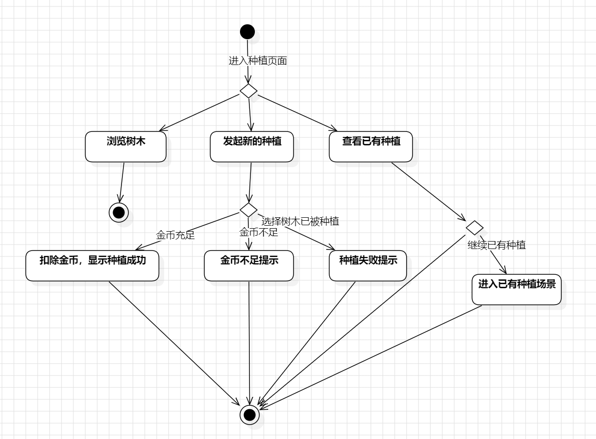
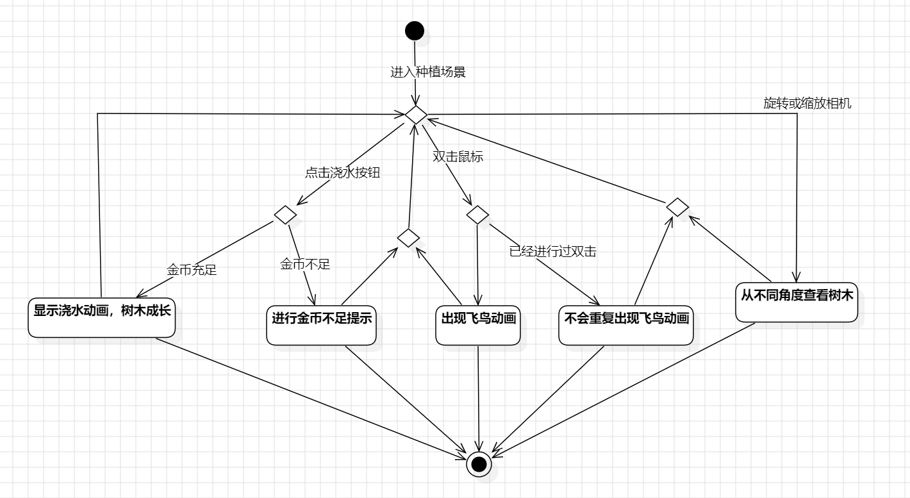

[TOC]

## 1. 介绍

- 青青森林项目旨在打造一个模拟支付宝蚂蚁森林游戏核心逻辑的平台，用户可以通过对选定树木进行浇水和种植，以实际行动践行绿色经济、低碳生活理念。

- 本项目由贾金原老师指导，其主要内容围绕绿色环保主题展开。在项目中，用户能够体验到真实的树木种植过程，通过浇水给树木提供养分，看着树木茁壮成长。
- 为了保证用户的基本体验，我们实现了登录、注册功能，让用户能够轻松创建自己的账号，参与到项目中来。同时，还设置了答题获取金币的功能，不仅增加了用户的参与度，还能让用户在答题过程中学习到更多关于绿色经济、低碳生活的知识。通过这些功能，用户可以在青青森林中感受到环保的乐趣，同时为绿色经济、低碳生活贡献自己的一份力量。我们希望通过这个项目，让更多的人了解绿色环保的重要性，积极参与到环保行动中来。

### 1.1 项目目标

- 在青青森林项目中，我们致力于打造一个创新且独具特色的游戏体验。在复现蚂蚁森林核心种植逻辑的基础上，我们将游戏画面从二维提升至三维，这一转变极大地增强了游戏的真实感与沉浸感。

- 我们突破了蚂蚁森林设计上低幼化的局限，为用户带来更具深度和成熟度的游戏体验。用户可以在游戏场景中与树木进行丰富多样的交互。例如，能够从不同角度观察树木，无论是近距离地欣赏树木的细节，还是从远距离感受树木在整个环境中的姿态，都能让用户更加深入地了解树木的生长过程。
- 游戏还提供了场景中的动画交互以及真实多样的环境模拟。在游戏中，飞鸟在天空中翱翔，水面泛起涟漪，山丘连绵起伏，沙漠一望无垠。这些元素不仅丰富了游戏场景，还为用户营造出一个真实且生动的自然环境。用户可以在这样的环境中模拟进行各种活动，如漫步在森林中，看微风吹过树枝摇曳，欣赏鸟儿成群飞在天空；或是在水边驻足，欣赏水中的树影。通过这些交互，用户能够更加直观地感受到绿色环保的魅力，增强对绿色经济、低碳生活理念的理解与认同。
- 我们希望通过青青森林项目，让用户在享受游戏乐趣的同时，能够积极参与到绿色环保行动中来，共同为打造一个更加美好的地球家园贡献力量。

### 1.2 项目范围

- 在青青森林项目中，我们以蚂蚁森林的核心逻辑为基础，将重点放在为用户打造一个在 3D 场景下进行树木种植的独特体验。这一体验不仅仅是简单地种植树木，而是深度融入了丰富的 3D 元素，让用户仿佛置身于真实的森林环境之中。

- 我们对树木种植功能进行了全面且细致的设计。用户能够在 3D 场景中选择不同种类的树木进行种植，每一种树木都具有独特的形态、生长周期和外观特征。通过模拟真实的种植过程，用户可以了解到树木生长的各个阶段，从种子发芽、幼苗成长到最终长成参天大树。同时，用户还可以根据自己的喜好和需求，对树木进行浇水操作，促进树木的生长。
- 为了保障基本的游戏性，我们完成了登录注册功能。用户可以通过注册账号，轻松地进入游戏平台。登录后，用户可以方便地查看自己的种植信息。此外，我们还设计了答题获取金币的功能。用户在答题过程中，不仅可以获取金币，还能通过回答问题，学习到更多关于绿色环保、低碳生活等方面的知识。
- 值得注意的是，本项目聚焦于树木种植以及相关的基础功能，蚂蚁森林其他功能如社交互动、公益活动等在本项目中并未涉及。我们将集中精力优化和完善树木种植的核心功能，为用户提供一个更加专注、高效且充满乐趣的游戏体验。我们希望通过这一项目，让用户在享受游戏乐趣的同时，能够更加深入地了解绿色环保的重要性，积极参与到绿色经济建设中来。

### 1.3 文档概述

在本文档中，我们将提供关于青青森林项目功能性需求和非功能性需求的具体细节，同时提供基于场景、基于类、基于行为的需求建模细节。

## 2. 总体描述

### 2.1 产品角度概述

- 青青森林是一款富有创意的3D树木种植游戏，旨在为用户提供一个沉浸式的自然体验平台。在游戏中，玩家可以从多种精美的3D树木中自由选择，并将它们种植在各具特色的3D场景中。无论是静谧的森林、广袤的沙漠，还是起伏的山丘，青青森林都为玩家呈现了丰富多样的环境选择。通过多角度的视角，玩家可以全方位观察和欣赏自己栽种的树木，感受不同场景下自然的和谐之美。

- 玩家在注册并登录后，可以通过参与有趣的答题活动来获取金币，这不仅增加了游戏的互动性和趣味性，还激励玩家不断学习和挑战自我。获得的金币可以用于在游戏中为树木浇水，促进它们的成长与繁茂。随着时间的推移，玩家将见证自己种植的树木从幼苗逐渐成长为茂盛的大树，这一过程不仅带来了成就感，也增强了玩家对自然生态的理解和关爱。
- 青青森林不仅仅是一款娱乐游戏，更是一个传递绿色生活理念的平台。通过观察树木的成长过程，玩家能够深刻体会到环保和可持续发展的重要性。游戏设计精巧，将绿色生活的理念融入其中，鼓励用户在虚拟世界中践行环保行动，并将这些理念延伸到现实生活中。青青森林致力于通过趣味性与教育性的结合，培养用户的环保意识，倡导健康、绿色的生活方式，助力建设更加美好的地球家园。

### 2.2 产品功能

青青森林为用户提供了丰富多样的功能，旨在打造一个互动性强且寓教于乐的3D树木种植体验。

- 用户注册功能简化了进入青青森林的门槛。新用户只需提供基本信息即可快速完成注册。注册过程安全便捷，确保用户的个人信息得到妥善保护，让玩家能够安心享受游戏的乐趣。
- 在青青森林中，用户可以通过参与答题活动来获取金币。这一功能不仅增加了游戏的互动性和挑战性，还鼓励用户在回答问题的过程中学习环保知识和绿色生活理念。每完成一题，用户都能获得一定数量的金币，进一步增强了游戏的趣味性和教育意义。
- 用户发起新的种植功能允许玩家在不同的3D场景中开始新的树木种植项目。无论是选择在宁静的森林中还是在荒凉的沙漠，玩家都可以根据自己的喜好和创意，开启一段独特的种植之旅，打造属于自己的绿色空间。
- 查看已有种植功能让用户能够方便地管理和浏览自己之前种植的树木项目。通过一个直观的界面，用户可以快速查看每棵树的生长状态、所在的场景，确保每一个种植项目都能得到细致的关注和照料。
- 选择树木进行种植功能提供了丰富多样的树木品种供用户挑选。无论是高大挺拔的松树，还是花朵绚烂的樱花树，玩家都可以根据自己的审美和环境需求，选择最适合的树种，打造多姿多彩的3D森林景观。
- 用户选择继续进行已有种植功能，使得玩家能够在任何时候回到之前的种植项目，继续为树木的成长付出努力，用户能够轻松管理和发展自己的绿色天地。
- 在场景中消耗金币进行浇水功能是游戏中的核心互动环节。玩家可以使用通过答题获得的金币为树木浇水，促进它们的健康成长。这一机制不仅增强了玩家的参与感和责任感，还让用户在虚拟世界中体验到关爱自然的乐趣。
- 用户在场景中多角度观察树木功能提供了全方位的视角，让玩家能够从不同角度欣赏自己种植的树木。通过旋转、缩放等操作，用户可以细致地观察树木的每一个细节，感受其在不同光影下的美丽变化，提升整体的沉浸体验。
- 用户点击激活互动动画功能为青青森林增添了生动有趣的元素。当玩家点击特定的树木或场景元素时，动画效果会立即呈现。这些互动动画不仅丰富了游戏的视觉效果，还增强了用户的参与感和互动乐趣，使整个种植过程更加生动和富有吸引力。

### 2.3 用户特征

- 环保意识强烈的年轻人是青青森林的重要用户群体。这部分用户通常关心环境保护和可持续发展，乐于通过游戏这种轻松有趣的方式学习和传播绿色生活理念。他们喜欢参与能够带来实际社会影响的活动，青青森林通过树木种植和成长过程，让他们在虚拟世界中体验环保的重要性，并将这种意识延伸到现实生活中。此外，这些年轻人通常具备较高的科技素养，能够轻松适应和享受3D游戏带来的沉浸式体验。
- 家庭用户和家长也是青青森林的潜在用户。这类用户希望通过游戏与孩子共同参与有益身心的活动，青青森林提供了一个适合家庭互动的平台。家长们可以与孩子一起种植树木，观察其成长过程，不仅增进亲子关系，还能在游戏中教育孩子了解自然和环保的重要性。此外，青青森林的答题获取金币功能也为家庭成员之间的互动增添了趣味性和教育性，适合各个年龄段的孩子共同参与。
- 休闲游戏爱好者也是青青森林的重要用户群体。这些用户通常寻求轻松、放松的游戏体验，喜欢在繁忙的日常生活中找到一个宁静的虚拟空间。青青森林通过多样化的3D场景和树木种植机制，提供了一个让他们放松心情、享受自然美景的理想平台。多角度观察和互动动画功能进一步增强了游戏的视觉享受，使得休闲游戏爱好者能够在游戏中找到持续的乐趣和满足感。
- 教育机构和教师也可能将青青森林作为教学辅助工具使用。通过游戏化的种植和成长过程，教师可以引导学生学习关于植物生长、生态系统和环境保护的知识。青青森林的答题功能和金币机制能够激发学生的学习兴趣，使教育过程更加生动有趣。教育机构可以利用这一平台开展互动性强的环保教育活动，培养学生的环保意识和动手能力

### 2.4 系统开发约束

#### 2.4.1 开发语言与框架

- 开发语言：
  - **前端**：采用 JavaScript ES6+ 标准进行开发，这一标准为前端开发带来诸多便利，如更简洁的语法、更强大的异步处理能力，能够高效地构建出交互性强、响应迅速的用户界面，满足现代 Web 应用对于流畅体验的需求。
  - **后端**：基于 Node.js 平台构建，Node.js 的事件驱动、非阻塞 I/O 模型使其天生具备支持高并发请求的优势，能轻松应对大量并发访问，同时异步操作可大幅提升系统性能，确保后端服务的高效稳定运行。
- 框架 / 库：
  - 前端：
    - Three.js 作为核心依赖库，承担着构建复杂 3D 场景、精确渲染模型以及实现流畅交互的重任。它提供了丰富多样的功能与工具，让开发者能够打造出逼真且引人入胜的 3D 视觉效果，前提是客户端设备支持 WebGL，WebGL 作为在网页上渲染 3D 图形的关键技术，为 Three.js 的功能实现提供底层支撑。
    - dat.gui 专为开发人员频繁调整 3D 渲染参数以追求最优视觉效果而设计，通过它可便捷地创建参数调试界面与实时控制面板，实时查看不同参数设置下的 3D 场景变化，加速优化进程。
    - OrbitControls.js 赋予用户在 3D 场景中进行旋转、平移、缩放等交互操作的能力，极大增强了用户对 3D 内容的操控感，提升体验的沉浸度与趣味性。
  - 后端：
    - Express.js 作为实现 RESTful API 的得力框架，能够快速搭建起后端服务架构，以简洁明了的方式定义路由、处理请求与响应，完美适配前后端分离的开发模式，让前端专注于界面呈现，后端聚焦业务逻辑处理，二者通过 HTTP 接口高效协同工作。
    - MySQL 用于存储用户数据、树模型信息、用户操作日志等关键数据。关系型数据库 MySQL 凭借其完善的事务处理机制与强大的数据一致性保障能力，确保在复杂业务场景下，数据的准确性、完整性得到可靠维护，为系统稳定运行筑牢根基。
- 工具链与开发环境：
  - 使用 Vite 为项目开发注入强大动力，提供极速的开发与构建体验。其热模块替换（HMR）特性尤其突出，能够在代码修改瞬间实时更新页面，极大缩短开发反馈周期，特别适用于对实时热更新要求极高的项目，让开发者时刻保持高效节奏。
  - 引入 Webpack 进行资源打包优化，它能够深度分析项目依赖，将众多分散的模块打包成少量优化后的文件，确保最终部署的应用在较低配置客户端设备上也能流畅运行，有效拓展了应用的兼容性边界。

#### 2.4.2 项目依赖

本项目所有依赖库均通过 npm 进行统一管理：

- **生产环境依赖**：核心依赖如 Three.js、dat.gui、mysql2 等。Three.js 直接驱动前端 3D 场景构建与渲染；dat.gui 助力开发阶段精细调优；mysql2 作为连接 MySQL 数据库的关键模块，保障后端数据的顺畅读写，它们协同发力确保生产环境下系统功能完整、稳定运行。
- **开发环境依赖**：涵盖 vite、vite-plugin-glsl、webpack 等。Vite 以其闪电般的开发服务器启动速度与即时热更新，让开发过程如丝般顺滑；vite-plugin-glsl 专为处理 GLSL（图形着色器语言）文件优化，满足 3D 开发对复杂着色需求；Webpack 凭借强大的资源打包能力，在项目部署前对代码、样式、资源进行深度整合与优化，确保面向不同环境的兼容性。需特别注意的是，以上依赖实现的前提是 npm 仓库持续可用，且所有依赖包均可在开发环境中准确无误地安装与稳定运行，任何环节的异常都可能阻碍项目推进。

### 2.5 运营环境约束

#### 2.5.1 硬件与运行环境

- 服务器端：

  - **CPU**：配置至少 2 核处理器，推荐采用 4 核，多核架构支持多线程并发处理，对于服务器运行多个 API 请求至关重要。多线程机制可让服务器同时处理多个任务，避免请求排队拥堵，确保系统响应的及时性，即便在高流量时段也能维持稳定性能。

  - **内存**：建议内存容量 4GB 起步，推荐配置 8GB 或更高。系统运行过程中，部分数据需缓存在内存，以此减少数据库查询延迟，提升数据获取速度。充足的内存空间可容纳更多缓存数据，降低频繁数据库交互带来的性能开销，保障系统高效运转。

  - 存储：

    - 前端资源（如 3D 模型、图片）预计占用约 5GB 存储空间，这些资源是构建丰富用户界面的关键素材，需妥善存储以便快速加载呈现。
    - 数据库方面，用于存储用户、树种类、操作记录等核心数据，考虑到数据的持续增长与长期保存需求，预留 50GB 以上存储空间较为稳妥，确保系统在长期运行过程中不会因存储不足而受限。

  - **网络**：网络带宽至少达到 100Mbps，如此方能确保大量用户并发访问时，数据传输迅速，用户操作无明显延迟感知。这一带宽配置是基于支持至少 50 个并发用户连接的场景预估，保障每个用户都能享受到流畅的在线体验。

  - 操作系统

    ：

    - 推荐选用 Linux 操作系统（如 Ubuntu 20.04+），Linux 系统以其卓越的稳定性、高效的资源管理以及对 Node.js 和 MySQL 的原生良好支持，为服务器端运行提供坚实基础，确保长时间稳定运行，降低运维成本。
    - 虽也兼容 Windows Server，但由于其与 Node.js 和 MySQL 配合时需额外安装系列工具来强化安全性与性能优化，相较而言，Linux 是更优选择。

- 客户端：

  - 硬件要求：
    - 设备必须支持 WebGL 2.0（或更高版本），这是流畅渲染 3D 场景的硬性指标。WebGL 2.0 相较于前代版本，在图形渲染性能、功能特性上有显著提升，能够精准呈现复杂 3D 模型与特效，为用户带来震撼视觉体验。
    - 设备内存至少 4GB，以确保在运行包含 3D 场景的应用时，系统有足够内存空间加载资源、运行程序，避免因内存不足导致卡顿甚至崩溃，保障流畅交互。
  - 浏览器要求：
    - 强烈推荐使用现代浏览器（Chrome 80+、Firefox 74+、Safari 13+），这些浏览器对 JavaScript ES6 标准以及 WebGL 技术有着出色的兼容性支持，能够完美展现应用前端精心设计的各类功能与视觉效果，同时确保支持安全的 HTTPS 访问，保护用户数据传输安全。

#### 2.5.2 网络环境

- **服务器端网络**：服务器必须配备公网 IP 地址，并全面支持 HTTPS 协议。公网 IP 是服务器对外提供服务的基础，确保全球用户可访问；而 HTTPS 协议则利用加密技术保障数据在传输过程中的机密性与完整性，防止信息泄露与篡改。此外，服务器运行环境需提供稳定、低延迟（小于 50ms）的公网连接，这对于实时性要求较高的应用至关重要，如 3D 场景数据传输、API 实时响应等，低延迟能让用户操作近乎实时反馈，提升交互体验。
- **客户端网络**：客户端用户需具备至少 10Mbps 的网络速度，以保证流畅加载 3D 模型、图片等资源以及及时接收后端数据响应。考虑到用户日常使用场景，假设用户主要通过 WiFi 或稳定的 4G/5G 网络访问平台，这类网络连接通常能满足带宽需求，但若网络不稳定或带宽不足，可能导致页面加载缓慢、交互卡顿等不佳体验。

### 2.6 数据与安全依赖

#### 2.6.1 数据依赖

- 前端依赖：
  - 前端所需加载的 3D 模型统一存储为 GLTF 格式，GLTF 格式具有高效压缩、快速加载的特性，假设模型文件大小通常不会超过 10MB，这既能保证模型细节丰富度，又可在多数网络环境下实现快速呈现，避免用户长时间等待加载。
  - 前端动态渲染高度依赖后端实时返回的树种类、种植状态等数据，这些数据实时更新前端展示内容，让用户获取最新信息，如树的生长进度、不同种类树的特征呈现等，前后端数据协同保障交互体验的连贯性与信息准确性。
- 后端依赖：
  - 数据库需预先创建并填充基础数据表，包括：
    - users 表：专注存储用户详细信息，如账号、密码、个人资料等，是用户管理与个性化服务的基石。
    - trees 表：详细记录各类树的品种信息，涵盖树名、外观特征、生长习性等，为前端展示与业务逻辑处理提供数据源头。
    - user_trees 表：精准记录用户种植的每一棵树及其实时状态，关联用户与树的信息，是实现用户种植行为跟踪、状态管理的关键支撑。
    - 上述功能实现基于所有数据均可通过 MySQL 稳定存储与高效查询，MySQL 的强大数据管理能力确保数据的有序组织与快速检索。

#### 2.6.2 安全性

- 数据库访问严格实施强密码策略与权限分级控制，强密码有效抵御暴力破解风险，权限分级确保不同角色用户（如管理员、普通用户）只能在授权范围内操作数据，防止数据泄露与恶意篡改。
- 服务器端配置 HTTPS 协议，对传输中的用户数据进行加密处理，从源头上保障数据在网络传输过程中的安全，即便数据遭遇拦截，加密措施也能让信息难以被窃取解析。
- 充分依赖现代浏览器内置的安全策略，如 CORS（跨域资源共享）机制精准控制跨域数据交互，Same-Origin Policy（同源策略）防范恶意脚本跨站攻击，合力抵御 XSS（跨站脚本攻击）和 CSRF（跨站请求伪造）等常见网络攻击手段，全方位守护用户数据与系统安全。

### 2.7 性能与扩展性依赖

#### 2.7.1 性能优化

- 前端性能：
  - 选用 GLTF 模型文件作为 3D 资源承载格式，基于其优化的结构与高效压缩算法，相较于传统模型格式，加载速度大幅提升，能在短时间内将复杂 3D 场景呈现给用户，减少等待烦躁。
  - 假设客户端设备支持硬件加速渲染，借助 GPU（图形处理器）强大的并行计算能力，可将 3D 渲染任务高效分担，显著提高帧率，让 3D 场景动画更加流畅顺滑，增强视觉沉浸感。
- 后端性能：
  - 针对数据库表精心优化索引，索引如同书籍目录，能让数据库查询快速定位所需数据，极大减少查询时间，尤其在高并发查询场景下，确保系统响应迅速，避免因查询缓慢导致用户等待超时。
  - 假设数据库负载不超过 100 并发连接，此为系统稳定运行的性能基线，通过优化数据库连接池管理、查询语句优化等措施，确保在该负载范围内系统响应高效稳定，为用户提供优质服务体验。

#### 2.7.2 可扩展性

- **架构扩展**：后端接口遵循 RESTful API 设计规范，这种架构风格以资源为中心，具有清晰、简洁、易理解的特点，方便未来功能模块的迭代扩展。无论是新增业务功能，还是对接新的第三方服务，RESTful API 都能轻松适配，假设未来需支持更多类型客户端访问，如移动端 App，其统一接口风格可快速实现多端对接，复用现有业务逻辑，降低开发成本。
- **用户扩展**：考虑到项目发展规划，假设初期用户规模在 100 - 500 人，系统架构设计从一开始便充分考量扩展性，从服务器硬件配置预留、软件架构分层解耦，到数据库表结构优化，全方位确保系统具备平滑扩展至 5000 用户的能力，以应对业务增长带来的挑战，保障服务质量稳定如初。

## 3. 具体需求

### 3.1 用例建模

**总体用例：**

#### 3.1.1 登录注册子系统：用户登录

| 用例属性 | 对应描述 |
| --- | --- |
| 用例名称 | 用户登录 |
| 参与者 | 用户 |
| 用例描述 | 用户在登录页面输入账号密码进行登录 |
| 前置条件 | 用户拥有账号 |
| 后置条件 | 用户登录后可以体验游戏全部功能 |
| 基本事件流 | 1. 用户输入账号密码   2. 用户成功登陆 |
| 其它事件流 | 用户没有账号，可跳转至注册页面 |
| 异常事件流 | 账号密码输入错误，进行错误提示|

#### 3.1.2 登录注册子系统：用户注册

| 用例属性 | 对应描述 |
| --- | --- |
| 用例名称 | 用户注册 |
| 参与者 | 用户 |
| 用例描述 | 用户在注册页面进行注册 |
| 前置条件 | 无 |
| 后置条件 | 用户注册账号后可以进行登录 |
| 基本事件流 | 1. 用户输入账号、密码和电话   2. 用户成功注册 |
| 其它事件流 | 无 |
| 异常事件流 | 若输入非有效手机号，进行错误提示|

#### 3.1.3 获取金币子系统：用户答题

| 用例属性 | 对应描述 |
| --- | --- |
| 用例名称 | 用户答题 |
| 参与者 | 用户 |
| 用例描述 | 用户在答题界面通过答题获取金币 |
| 前置条件 | 用户成功登录 |
| 后置条件 | 用户可以使用金币在种植界面浇水或在种植界面种植新树木 |
| 基本事件流 | 1. 用户进入答题界面   2. 用户选择题目答案   3. 若答案正确，用户获得金币   4. 若答案错误，进行错误提示并退出 |
| 其它事件流 | 无 |
| 异常事件流 | 无|

#### 3.1.4 种树子系统：浏览树木

| 用例属性 | 对应描述 |
| --- | --- |
| 用例名称 | 浏览树木 |
| 参与者 | 用户 |
| 用例描述 | 用户在种植页面查看树木 |
| 前置条件 | 用户成功登录 |
| 后置条件 | 无 |
| 基本事件流 | 1. 用户进入种植页面   2. 用户可以查看所有种类树木 |
| 其它事件流 | 无 |
| 异常事件流 | 无|

#### 3.1.5 种树子系统：发起新的种植

| 用例属性 | 对应描述 |
| --- | --- |
| 用例名称 | 发起新的种植 |
| 参与者 | 用户 |
| 用例描述 | 用户在种植页面发起新的种植 |
| 前置条件 | 用户成功登录 |
| 后置条件 | 无 |
| 基本事件流 | 1. 用户进入种植页面   2. 用户可以发起新的种植 |
| 其它事件流 | 无 |
| 异常事件流 | 1. 若选择的树木已被种植过，则无法重复种植   2. 若金币不足，无法进行新的种植|

#### 3.1.6 种树子系统：查看我的种植

| 用例属性 | 对应描述 |
| --- | --- |
| 用例名称 | 查看我的种植 |
| 参与者 | 用户 |
| 用例描述 | 用户在种植页面查看已有种植 |
| 前置条件 | 用户成功登录 |
| 后置条件 | 用户可继续已有种植 |
| 基本事件流 | 1. 用户进入种植页面   2. 用户可以查看已有种植 |
| 其它事件流 | 无 |
| 异常事件流 | 无|

#### 3.1.7 种树子系统：继续已有种植

| 用例属性 | 对应描述 |
| --- | --- |
| 用例名称 | 继续已有种植 |
| 参与者 | 用户 |
| 用例描述 | 用户查看我的种植后继续已有种植 |
| 前置条件 | 用户查看我的种植 |
| 后置条件 | 无 |
| 基本事件流 | 1. 用户选择继续已有种植   2. 用户在种植场景中进行互动 |
| 其它事件流 | 无 |
| 异常事件流 | 若用户未进行过种植，则无法进行此行动|

#### 3.1.8 场景子系统：浇水

| 用例属性 | 对应描述 |
| --- | --- |
| 用例名称 | 浇水 |
| 参与者 | 用户 |
| 用例描述 | 用户在场景中消耗金币进行浇水 |
| 前置条件 | 1. 用户已有种植   2. 用户金币充足 |
| 后置条件 | 1. 用户可继续在场景中互动或浇水   2. 树木成长 |
| 基本事件流 | 1. 用户进入种植场景   2. 用户消耗金币进行浇水 |
| 其它事件流 | 无 |
| 异常事件流 | 若金币不足，则浇水无法成功|

#### 3.1.9 场景子系统：双击查看飞鸟

| 用例属性 | 对应描述 |
| --- | --- |
| 用例名称 | 双击查看飞鸟 |
| 参与者 | 用户 |
| 用例描述 | 用户在场景中双击查看飞鸟动画 |
| 前置条件 | 用户已进入种植场景 |
| 后置条件 | 用户可继续在场景中继续互动或浇水  |
| 基本事件流 | 1. 用户进入种植场景   2. 用户双击查看飞鸟动画 |
| 其它事件流 | 无 |
| 异常事件流 | 若已进行过双击，则不会重复出现飞鸟动画|

#### 3.1.10 场景子系统：旋转缩放摄像机

| 用例属性 | 对应描述 |
| --- | --- |
| 用例名称 | 旋转缩放摄像机 |
| 参与者 | 用户 |
| 用例描述 | 用户在场景中旋转缩放摄像机以在不同角度查看树木 |
| 前置条件 | 用户已进入种植场景 |
| 后置条件 | 用户可继续在场景中继续互动或浇水 |
| 基本事件流 | 1. 用户进入种植场景   2. 用户旋转缩放摄像机以在不同角度查看树木 |
| 其它事件流 | 无 |
| 异常事件流 | 无|

### 3.2 活动建模

#### 3.2.1 登录注册子系统

- 用户进入青青森林应用后，首先会被引导至登录界面。在登录界面，用户需要根据自己的实际情况选择下一步操作。如果用户已经拥有账户，他们将直接输入账号和密码进行登录。系统会对用户输入的信息进行验证，当账号和密码均正确时，用户将顺利进入应用，开始使用相关功能。然而，如果用户输入的账号或密码存在错误，系统会立即弹出错误提示信息，提醒用户检查并重新输入。这种设计确保了用户登录过程的安全性和严谨性，同时允许用户在遇到输入错误时快速纠正，继续尝试登录。

- 对于尚未注册的用户，登录界面提供了一个引导注册的选项。用户选择注册后，将被系统转至注册界面，进入新的流程。在注册界面，用户需要填写账号、密码和手机号码等必要信息。系统对用户输入的数据进行格式校验和有效性检查，确保手机号码格式合法。如果手机号有效，注册流程会继续，系统将创建新的用户账户，并提示用户注册成功。注册成功后，用户可以直接登录并进入应用，开始使用相关功能。而如果用户输入的手机号格式无效，系统将提示错误信息，防止无效数据的提交，同时允许用户重新填写信息，再次尝试注册。
- 在整个登录和注册过程中，系统设计了灵活的流程跳转机制。例如，用户在注册过程中如果需要返回登录界面，可以随时进行切换。用户在登录时如果遇到输入错误，也能迅速返回登录界面重新尝试。这种交互方式大大提升了用户体验的流畅性，减少了繁琐的重复操作，为用户提供了更便捷的流程控制。
- 此外，流程中设置了多个判断条件来确保操作的严谨性。例如，在用户输入账号和密码后，系统立即验证其准确性，如果信息有误，系统会明确指出问题，帮助用户快速定位错误。在注册过程中，手机号码的有效性验证是防止数据冲突的重要步骤，这种验证机制提高了系统数据管理的规范性和安全性。
- 整个活动的设计充分考虑了用户操作的多样性和潜在问题，通过错误提示和返回功能确保用户在登录或注册失败时能够及时调整操作。无论是登录时的账号验证，还是注册时的手机号检查，系统都采用了严格的流程控制，确保用户信息的准确性和安全性。最终，用户能够通过流畅且安全的操作流程顺利进入应用，开始享受青青森林提供的各项功能和互动体验。

#### 3.2.2 获取金币子系统

- 用户进入答题界面后，系统提供了通过回答问题来获取金币的交互功能。在进入答题界面后，用户将面对一系列问题，并根据系统提示选择答案。用户的回答将决定接下来的流程，如果回答正确，系统会增加用户的金币数量，而如果回答错误，系统会给出明确的错误提示信息。整个流程围绕答题、判断答案和反馈结果展开，既保证了用户互动的趣味性，也强化了学习和奖励机制的关联性。

- 在答题过程中，如果用户回答正确，系统会立即识别该答案，并触发金币数量增加的操作。系统会将用户当前账户的金币数量进行更新，确保答题带来的奖励即时生效。这种即时反馈机制不仅激励用户继续参与答题，还增强了游戏过程的成就感和参与感。金币的累积为后续游戏中的其他操作提供资源支持，例如为树木浇水等功能，因此用户在答题环节的表现与整体游戏体验紧密关联。答题正确后，用户可以选择继续回答更多问题，以进一步增加金币数量，或者选择结束答题，返回到其他游戏功能模块。这种灵活的选择为用户提供了自由控制答题进程的权利，提升了操作的便捷性和舒适度。
- 如果用户回答错误，系统会立即识别错误答案，并触发错误提示功能。用户在收到错误提示后，可以选择继续答题以提高金币数量，也可以结束答题流程，返回其他界面或功能模块，进一步增强了系统的交互性和灵活性。
- 整个答题获取金币的流程围绕正确与错误两种结果进行动态处理，每个环节都提供了即时反馈和合理的引导，确保用户无论在答题成功或失败时都能够获得清晰的下一步操作指示。金币数量的增加机制激励用户通过知识获取奖励，而错误提示机制则鼓励用户反复尝试和探索答案，提高游戏的教育性和趣味性。流程中还包含了用户在每轮答题后的选择权，允许用户决定继续挑战或退出答题，以适应不同用户的需求和节奏，为整个互动过程增加了更多可控性和自由度。
- 最终，用户在答题界面完成所有操作后，可以选择结束答题流程，系统将用户引导回到游戏的其他模块或主界面。整个流程不仅强调了互动与反馈的实时性，还通过金币奖励和错误提示机制构建了学习和激励的闭环，既为用户提供了娱乐体验，也将教育与知识学习融入游戏之中，从而增强了青青森林的教育意义和趣味性

#### 3.2.3 种树子系统

- 用户进入种植页面后，系统为用户提供了多个操作选项，包括浏览树木、发起新的种植以及查看已有种植。用户可以根据自己的需求选择具体操作，每个选择都会引导进入不同的流程，从而实现树木种植和场景管理的功能。在整个过程中，系统通过金币数量的检测、状态反馈和错误提示等机制，确保流程的合理性和可操作性。

- 当用户选择浏览树木时，系统允许用户查看当前可用的树木。用户可以自由查看树木的外观，以便做出种植决策。该功能为用户提供了充分的参考信息，便于用户规划自己的种植方案。如果用户只是浏览树木而不进行后续操作，则系统将直接退出该流程，返回到主页面或其他界面。
- 如果用户决定发起新的种植流程，系统会进一步引导用户选择想要种植的树木。在此过程中，系统会对用户的金币数量进行检测。如果用户的金币数量充足，系统将扣除相应金币，并显示种植成功，成功启动树木的种植过程。在进入新场景后，用户可以对树木进行浇水等操作，以确保树木的持续成长。然而，如果用户的金币不足，系统会弹出金币不足的提示信息，明确告知用户无法进行该操作，并终止种植流程。用户需要返回答题获取金币增加金币余额后，才能再次尝试种植新树木。这种金币检测机制不仅限制了用户的操作权限，还鼓励用户参与其他活动以获取更多资源，从而增强游戏的互动性和可持续性。
- 在发起新的种植流程中，如果用户选择的树木已经被种植，系统将立即提示种植失败，并阻止用户重复种植相同的树木。这一机制确保了每个树木实例的唯一性，避免了资源浪费和操作混乱。同时，该提示信息也会引导用户返回种植选择页面或尝试其他树木种类，以便快速调整种植计划并继续流程。
- 用户还可以选择查看已有种植的功能，以管理或继续已有的树木种植项目。在查看已有种植流程中，系统会检测用户是否存在已经种植的树木。如果用户有可用的种植项目，系统会允许用户直接进入这些场景，继续养护和管理树木。用户可以对现有树木进行进一步的操作，如浇水、观察成长状态等，充分利用之前积累的金币和资源。如果用户选择退出或结束查看，系统会将用户返回到主界面或其他功能模块，保持流程的灵活性和便捷性。
- 整个种植活动的流程设计通过金币检测、状态反馈和错误提示等机制，确保用户操作的规范性和安全性。同时，流程中提供的浏览、发起新种植和查看已有种植等功能满足了用户不同阶段的需求。金币不足和种植失败的提示信息帮助用户快速了解问题并做出调整，而继续已有种植场景的选项则支持用户对先前种植项目的持续管理与优化，从而增强了互动性和用户体验的连贯性。最终，用户在完成相关操作后，可以根据自身需求退出流程或继续其他功能模块，充分体验青青森林应用的多样化功能和游戏性。

#### 3.2.4 场景子系统

- 用户进入种植场景后，可以进行一系列互动操作，包括浇水、观察树木的生长状态以及触发动画效果等。在进入场景时，用户首先面临多种操作选项，具体操作流程根据用户的选择和系统判断进行动态变化，从而保证种植过程的丰富性和趣味性，同时通过金币管理和动画效果提升互动体验的视觉表现力和操作反馈感。

- 用户可以点击浇水按钮进行树木养护操作。当用户发出浇水指令时，系统会首先检查用户账户中的金币数量是否充足。如果金币充足，系统将立即扣除相应的金币，并展示浇水动画效果，同时树木会显示成长变化，进一步增强用户对树木成长过程的参与感和成就感。浇水动画的展示使用户能够直观地感受到树木在养护过程中的成长变化，增加了操作的真实感和沉浸感。而如果系统检测到用户金币不足，系统将弹出金币不足的提示信息，明确告知用户当前金币余额无法支持浇水操作，并终止此次操作。这一判断机制不仅保障了用户资源管理的合理性，也引导用户在后续通过答题等方式补充金币，形成游戏功能的闭环和用户互动的连贯性。
- 在种植场景中，用户还可以通过双击鼠标触发飞鸟动画效果。系统会检测用户是否已经执行过双击操作。如果是首次双击，系统会触发飞鸟动画，为用户提供额外的视觉享受和互动反馈。这一动画的出现丰富了场景表现，增强了游戏的趣味性和动态感。然而，如果系统检测到用户已经执行过双击操作，系统将不会重复展示飞鸟动画，而是直接忽略用户的再次操作。这种设计避免了重复动画导致的体验疲劳，同时保证了动画触发的独特性和新鲜感，使用户的操作体验更加多样化和合理化。
- 除了交互操作，用户还可以通过旋转或缩放相机，从不同的角度查看树木。系统允许用户自由调整视角，观察树木的各个细节和生长状态，为用户提供更具沉浸感的互动体验。用户可以放大查看树木的叶片、枝干等细节，也可以旋转视角观察树木在整个场景中的布局和整体效果。这种功能不仅增强了用户对树木成长的参与感，也为用户提供了更高的可操作性和自由度，使用户能够充分探索和欣赏自己培育的成果。
- 整个操作流程中，系统通过对金币数量、交互状态和操作反馈的判断和处理，确保每一步操作的逻辑性和可控性。例如，在浇水操作中系统会明确提示金币是否充足，在触发动画过程中会检测操作状态以防止重复操作，这些设计既保障了系统资源的合理使用，也避免了用户因误操作导致的体验混乱。同时，动态的动画效果和自由视角调整功能增加了操作的丰富性和视觉吸引力，使整个种植过程更加生动和趣味盎然。
- 最终，无论用户是成功执行浇水操作并观看树木成长，还是通过双击触发飞鸟动画，亦或是调整视角观察树木的不同角度，系统都会根据用户的操作反馈状态，引导流程回到正常结束节点。整个流程设计充分考虑了互动性、反馈性和资源管理等方面，为用户提供了一个既富有娱乐性又具有教育意义的种植体验。用户在这个过程中不仅能够享受互动操作带来的乐趣，还能通过管理金币和照顾树木学习到绿色生活理念和环保意识。

### 3.3 基于类的建模

#### 3.3.1 总体类描述

- TreeDisplayer类负责展示用户种植的树木模型，是整个系统中与视觉呈现直接相关的核心类。它包含一个树木模型数组（treeModel[]），用于存储需要渲染的树木数据，并通过display()方法将树木模型显示在界面上。TreeDisplayer与MyTree类存在直接关联关系，通过MyTree类提供的用户树木信息加载相应模型，确保用户的种植成果能够在场景中可视化呈现。MyTree类是用户个人树木的集合，记录用户种植的所有树木实例，它与User类密切关联，表示每个用户都可以拥有多个已种植树木。TreeDisplayer类在系统中的作用主要是实现种植场景的动态渲染和用户成果的展示，增强视觉效果和沉浸感。

- TreeShop类为用户提供树木管理和选择的功能，它通过viewMyTree()方法展示用户当前拥有的树木清单，并支持用户检查树木的详细信息。TreeShop类与User类关联，直接从用户账户中获取种植数据，从而实现个性化管理。此外，TreeShop类与Tree类直接关联，负责处理具体树木对象的管理和操作。Tree类定义了树木的核心属性，如树木ID（treeID）、名称（treeName）、模型（Model）和等级（Level），并包含plantTree()和loadTree()方法。plantTree()方法用于初始化并添加新树木到场景中，而loadTree()方法负责动态加载已存在的树木模型。Tree类与用户账户、种植场景紧密联系，既提供树木实例的数据结构，又支持具体的种植和渲染功能，是整个系统种植管理的核心组成部分。
- User类是系统的核心控制类，负责用户管理和资源配置。它包含用户名（userName）、密码（password）、金币余额（coin）和用户树木集合（myTree[]）等关键属性。用户通过Register()和Login()方法完成账户注册与登录操作，并通过getCoin()方法获取金币奖励，用于种植树木和互动操作。User类是所有操作的基础，它与Question类关联，允许用户通过答题获取金币，形成游戏资源与学习机制的联动。Question类存储问题和答案的集合（questions[]和answers[]），提供display()方法展示题目，以及chooseRandomQuestion()方法随机抽取问题，增加互动性和趣味性，确保用户可以通过知识挑战获取成长资源。
- Scene类负责构建和加载种植场景，是系统视觉表现和互动操作的基础。它包含摄像头参数（camera）和场景对象（scene），并提供loadScene()方法加载整个场景环境。Scene类与多个环境控制类关联，包括Terrain类和Sky类，用于模拟真实环境。Terrain类定义地形的类型（type）和纹理（texture），提供addFlower()和loadTerrain()方法，支持地形美化和装饰元素添加，增强场景丰富性。Sky类控制天空效果，包含天空参数数组（skyParam[]）、太阳属性（Sun）和类型（type），并通过addSun()和loadSky()方法模拟光照和天空变化，为场景提供逼真的环境表现。Scene类的设计确保了种植过程的沉浸感和可操作性。
- Bird类负责场景中的动态互动效果，它包含模型信息（Model），通过triggerBird()方法触发飞鸟动画，为场景增添动态视觉效果，同时使用loadBird()方法加载鸟类模型，确保动画的可控性和灵活性。Bird类与Scene类关联，为场景提供额外的互动元素，提升用户体验的趣味性和生动感。
- Watering类是互动功能中的关键部分，专注于树木浇水操作。它包含模型数据（Model），通过triggerWatering()方法触发浇水动画，展示用户对树木的养护过程，同时通过loadBottle()方法加载浇水工具模型，确保视觉表现的完整性。Watering类与Tree类和Scene类关联，支持用户在种植过程中直接与树木互动，体现树木生长的动态反馈效果，从而提高用户对树木养护的参与度和责任感。
- 整体来看，系统以User类为中心，通过TreeShop和MyTree管理树木信息，并借助Tree类实现具体树木的种植和动态加载。同时，Scene类通过Terrain和Sky构建环境效果，并与Bird和Watering实现动态交互功能，为用户提供生动的互动体验。Question类为用户提供获取金币的机制，与User类紧密关联，保障用户资源供给的同时增加知识性和趣味性。TreeDisplayer类最终负责将所有种植成果以模型形式呈现，为整个系统的视觉表现提供支持。所有类及其方法相互协作，共同打造了一个集资源管理、场景构建和互动操作于一体的虚拟种植平台。

#### 3.3.2 CRC卡片(Class-Responsibility-Collaborator Card)

<table>
    <tr>
        <th>类：User</th>
    </tr>
    <tr>
        <td>用户类负责管理用户的基础信息，例如用户名、密码、金币余额，以及用户种植的树列表。用户可以通过该类实现注册、登录等操作。</td>
    </tr>
    <tr>
        <td>
            <table>
                <tr>
                    <td>职责</td>
                    <td>协作者</td>
                </tr>
                <tr>
                    <td>注册用户信息</td>
                    <td></td>
                </tr>
                <tr>
                    <td>用户登录验证</td>
                    <td></td>
                </tr>
                <tr>
                    <td>获取用户当前的金币数</td>
                    <td></td>
                </tr>
            </table>
        </td>
    </tr>
</table>

<table>
    <tr>
        <th>类：Tree</th>
    </tr>
    <tr>
        <td>树类负责描述用户可种植的树的信息，包括树的ID、名称、模型和等级。还提供种植和加载树模型的功能。</td>
    </tr>
    <tr>
        <td>
            <table>
                <tr>
                    <td>职责</td>
                    <td>协作者</td>
                </tr>
                <tr>
                    <td>初始化并加载树模型</td>
                    <td>Scene, TreeShop, MyTree</td>
                </tr>
                <tr>
                    <td>允许用户种植树</td>
                    <td>TreeShop</td>
                </tr>
            </table>
        </td>
    </tr>
</table>

<table>
    <tr>
        <th>类：Terrain</th>
    </tr>
    <tr>
        <td>地形类负责管理场景中的地形及其装饰物（如花卉）。</td>
    </tr>
    <tr>
        <td>
            <table>
                <tr>
                    <td>职责</td>
                    <td>协作者</td>
                </tr>
                <tr>
                    <td>根据类型加载不同地形</td>
                    <td>Scene</td>
                </tr>
                <tr>
                    <td>添加装饰性花卉</td>
                    <td></td>
                </tr>
            </table>
        </td>
    </tr>
</table>

<table>
    <tr>
        <th>类：Sky</th>
    </tr>
    <tr>
        <td>天空类负责管理场景的天空效果，包括天空背景、太阳和相关参数。</td>
    </tr>
    <tr>
        <td>
            <table>
                <tr>
                    <td>职责</td>
                    <td>协作者</td>
                </tr>
                <tr>
                    <td>配置天空参数</td>
                    <td></td>
                </tr>
                <tr>
                    <td>添加太阳模型 </td>
                    <td></td>
                </tr>
                <tr>
                    <td>加载天空环境</td>
                    <td>Scene</td>
                </tr>
            </table>
        </td>
    </tr>
</table>

<table>
    <tr>
        <th>类：Bird</th>
    </tr>
    <tr>
        <td>鸟类用于在场景中添加动态的鸟类对象，增强场景的动态效果。</td>
    </tr>
    <tr>
        <td>
            <table>
                <tr>
                    <td>职责</td>
                    <td>协作者</td>
                </tr>
                <tr>
                    <td>动态加载鸟类模型</td>
                    <td>Scene</td>
                </tr>
                <tr>
                    <td>触发鸟类动画效果</td>
                    <td>Scene</td>
                </tr>
            </table>
        </td>
    </tr>
</table>

<table>
    <tr>
        <th>类：MyTree</th>
    </tr>
    <tr>
        <td>管理和展示用户种植的树，提供一个展示用户个人成就的界面。</td>
    </tr>
    <tr>
        <td>
            <table>
                <tr>
                    <td>职责</td>
                    <td>协作者</td>
                </tr>
                <tr>
                    <td>管理用户种植的树列表</td>
                    <td>User</td>
                </tr>
                <tr>
                    <td>展示用户种植的树</td>
                    <td>Tree</td>
                </tr>
            </table>
        </td>
    </tr>
</table>

<table>
    <tr>
        <th>类：TreeShop</th>
    </tr>
    <tr>
        <td>树商店类负责提供用户可以购买和种植的树信息。</td>
    </tr>
    <tr>
        <td>
            <table>
                <tr>
                    <td>职责</td>
                    <td>协作者</td>
                </tr>
                <tr>
                    <td>查看和选择用户可以购买的树</td>
                    <td>User, Tree</td>
                </tr>
            </table>
        </td>
    </tr>
</table>

<table>
    <tr>
        <th>类：Question</th>
    </tr>
    <tr>
        <td>问题类用于提供问答功能，通过用户答题奖励金币，增强互动性。</td>
    </tr>
    <tr>
        <td>
            <table>
                <tr>
                    <td>职责</td>
                    <td>协作者</td>
                </tr>
                <tr>
                    <td>从问题库中随机选取问题</td>
                    <td></td>
                </tr>
                <tr>
                    <td>显示问题和选项</td>
                    <td>User</td>
                </tr>
            </table>
        </td>
    </tr>
</table>

<table>
    <tr>
        <th>类：Scene</th>
    </tr>
    <tr>
        <td>场景类是整个系统的核心，它负责加载和管理所有3D对象，包括树、地形、天空和动态对象（如鸟）</td>
    </tr>
    <tr>
        <td>
            <table>
                <tr>
                    <td>职责</td>
                    <td>协作者</td>
                </tr>
                <tr>
                    <td>初始化3D场景 </td>
                    <td></td>
                </tr>
                <tr>
                    <td>加载地形和天空</td>
                    <td>Terrain, Sky</td>
                </tr>
                 <tr>
                    <td>将用户操作的元素（树、鸟等）添加到场景中</td>
                    <td>Bird, Tree</td>
                </tr>
            </table>
        </td>
    </tr>
</table>

<table>
    <tr>
        <th>类：Watering</th>
    </tr>
    <tr>
        <td>浇水类模拟用户浇水操作，为树提供虚拟成长的过程。</td>
    </tr>
    <tr>
        <td>
            <table>
                <tr>
                    <td>职责</td>
                    <td>协作者</td>
                </tr>
                <tr>
                    <td>模拟浇水效果</td>
                    <td>Tree</td>
                </tr>
                <tr>
                    <td>加载浇水工具模型</td>
                    <td>Scene</td>
                </tr>
            </table>
        </td>
    </tr>
</table>

### 3.4 基于行为的建模

#### 3.4.1 查看我的种植

- 用户在查看已种植的树木时，首先通过交互界面点击进入已种植的树木查看选项。这一操作向MyTree对象发送请求，以获取用户当前种植的树木信息。MyTree对象接收到请求后，开始处理用户的查询需求，并从存储的数据中检索与用户相关的种植信息，随后将这些信息返回给用户界面。这一步操作确保了用户可以快速查看已种植树木的基础信息，如树木名称、种类和生长状态等，从而对用户的种植管理提供基础支持。

- MyTree对象在接收到用户请求并返回基础信息的同时，还进一步与Tree对象进行交互，获取更详细的树木相关信息。Tree对象负责管理树木的具体属性和状态，接到请求后，会从数据库或内存中检索树木模型、等级、种植时间等细节信息，并将结果返回给MyTree对象。MyTree对象在获取树木的详细信息后，将其汇总并发送给用户界面，确保用户不仅能看到基础信息，还能获取树木的具体状态和成长情况。这样，用户可以更全面地了解树木的成长进度及其当前表现，从而为后续的养护操作提供决策依据。
- 在用户获取了树木的相关信息后，可以进一步点击进入树木的种植场景。用户的这一操作会触发MyTree对象向Scene对象发送请求，要求加载种植场景的相关信息。Scene对象接收到请求后，会根据提供的树木数据动态构建种植场景，并将场景中的环境信息、地形布局以及树木模型加载到用户界面中。Scene对象返回场景信息后，用户界面立即展示完整的场景画面，用户可以通过交互界面观察树木在场景中的具体位置和生长状态。这一步操作不仅让用户能够直观查看种植环境，还为用户后续的操作（如浇水或动画互动）提供了基础支持。
- 整个过程中，MyTree对象充当了用户与其他功能模块之间的桥梁，负责接收用户请求、管理数据流转并协调Tree和Scene对象的响应。Tree对象专注于树木的详细数据管理，确保用户获取的信息准确且全面。而Scene对象则负责构建和渲染种植场景，为用户提供沉浸式的交互体验。各对象之间的消息传递通过同步调用确保了数据的连贯性和实时性，用户的每一步操作都能得到即时反馈，保证了交互过程的流畅性。
- 最终，当用户完成查看树木信息和进入种植场景的操作后，所有对象的交互流程也随之结束。用户可以通过场景界面进一步执行浇水或观察树木成长动画等操作，系统将根据用户后续的需求继续进行处理与响应。整个交互过程以用户需求为驱动，通过模块化的结构设计和明确的职责分工，实现了信息的快速检索、动态场景加载和实时数据反馈，满足了用户管理和观赏已种植树木的功能需求。

#### 3.4.2 答题

- 用户在进入答题流程后，首先发起答题请求，该请求被发送到Question对象中，启动答题交互过程。Question对象接收到请求后，立即调用自身的selectRandomQuestion()方法，从题库中随机抽取一道题目并返回给用户。题目的随机选择确保了每次答题的多样性和挑战性，提升了互动的趣味性和重复使用率。Question对象完成题目选择后，会将题目内容发送给用户，使用户可以查看题干和选项，为接下来的答题环节做好准备。

- 用户在查看题目后，继续选择答案并将选择结果提交给Question对象。Question对象接收到用户的答案后，会立即处理用户提交的信息，并进行答案验证。如果用户选择的答案正确，Question对象将向用户发送结果反馈，告知用户答题正确，并显示相应的提示信息或奖励。用户此时可以继续新的答题流程，也可以结束当前答题环节，从而实现流程的正向闭环。
- 当用户提交的答案错误时，流程进入条件分支alt块，触发“答案错误”的处理逻辑。在这种情况下，Question对象会返回答案错误的提示信息，通知用户当前答案不正确，并引导用户重新选择答案。此时，用户可以根据提示调整思路，重新分析题目，并再次提交答案。Question对象将根据用户新的提交答案继续验证，并再次向用户返回结果。如果第二次提交答案正确，流程恢复到正常状态，用户收到正确提示；如果答案再次错误，流程将重复alt块中的逻辑，直到用户选择正确答案或结束答题过程。
- 整个流程通过用户与Question对象之间的连续交互，实现了题目选择、答案验证以及错误提示的闭环处理。流程设计既保证了用户有充分的机会尝试回答问题，也提供了实时的反馈机制，帮助用户调整答案以最终完成题目挑战。此外，alt分支逻辑的设置为错误处理提供了灵活性，使用户可以多次修正错误答案，提高了用户体验的容错率和交互性。流程中每个步骤均由Question对象负责具体的数据管理和逻辑判断，确保题目选择的随机性、答案验证的准确性以及反馈提示的即时性。
- 最终，用户在答题过程中的互动可以通过连续答题或多次尝试形成学习闭环，Question对象通过不断响应用户输入和状态变化来维持流程的动态性和连续性，从而满足用户答题挑战、获取奖励和积累经验的需求。整个流程通过严格的逻辑控制和动态反馈设计，确保了答题过程既具有教育意义，又富有趣味性和互动性。

#### 3.4.3 浇水

- 用户在交互界面中点击浇水按钮后，首先触发与Scene对象的交互，启动浇水流程。Scene对象接收到用户的浇水请求后，会立即对用户当前的金币数量进行检查，以确认用户是否拥有足够的金币执行浇水操作。金币检查是整个浇水流程的前置条件，确保浇水操作只能在资源充足的情况下进行。Scene对象在完成金币验证后，将结果返回给用户界面。如果金币充足，流程继续向下执行；否则，用户会收到金币不足的提示，并终止当前浇水操作。

- 当金币验证通过后，Scene对象会进一步向Watering对象发送请求，要求加载浇水模型，以便呈现浇水动画效果。Watering对象接收到请求后，开始执行加载浇水模型的任务，确保浇水工具和水流效果能够在场景中动态展示。加载过程完成后，Watering对象将加载的模型返回给Scene对象，供其渲染和显示。在这一过程中，Watering对象负责处理与浇水动画相关的视觉效果和物理模型，保证浇水动作的真实感和动态表现力。Scene对象根据返回的浇水模型信息，将其集成到当前场景中，并准备向用户展示浇水效果。
- 同时，Scene对象还与Tree对象进行交互，以更新树木的生长状态。Scene对象向Tree对象发送请求，要求加载当前树木的状态信息，并将浇水操作的效果应用于树木模型中。Tree对象接收到请求后，处理树木生长状态的更新逻辑，例如提升树木的生长等级或改变树木的外观模型，以反映浇水后的变化。Tree对象完成状态更新后，会将更新后的树木模型信息返回给Scene对象，以便在场景中同步显示最新的树木成长状态。这一交互过程确保了用户的操作能够实时影响树木的成长情况，增强了互动性和操作的直接反馈感。
- Scene对象最终根据Watering和Tree对象返回的模型信息，将浇水动画效果和树木生长状态组合到当前场景中，并将最终的结果展示给用户。用户可以直观地看到浇水过程及其对树木的影响，例如水流动画、植物的生长变化等，从而进一步增强游戏的视觉表现力和沉浸感。整个流程通过Scene对象的协调控制，将用户的金币检查、浇水工具加载和树木状态更新整合为一个连贯的操作过程，确保每一步操作都具有明确的逻辑顺序和可视化反馈。
- 整个交互过程中，Scene对象作为主要的控制中心，负责处理用户请求、协调Watering和Tree对象的交互以及最终的场景渲染。Watering对象专注于浇水工具和动画效果的加载与展示，而Tree对象则负责树木的成长逻辑和状态管理。这种分工明确的设计确保了浇水操作的逻辑性和互动效果，既提供了资源管理和动画表现的保障，又增强了用户对操作结果的掌控感。最终，用户在界面上可以清晰地看到操作结果，感受到树木成长的变化，从而激励其继续参与养护和管理树木的活动。

#### 3.4.4 飞鸟动画

- 用户在交互界面中执行双击操作后，首先触发与Scene对象的交互，启动鸟动画的加载流程。Scene对象接收到用户的双击请求后，将该操作视为激活动画的指令，并向Bird对象发送请求，以获取鸟类模型的相关资源数据。此过程确保Scene对象可以协调动画元素的加载和管理，为后续的动画播放提供必要的素材支持。

- Bird对象接收到来自Scene对象的请求后，开始处理鸟类模型的加载任务。Bird对象作为管理飞鸟动画的专门模块，负责处理鸟类模型的资源调用和初始化操作。在收到请求后，它会从资源库中提取所需的鸟类模型数据，并将模型加载到内存中，准备向Scene对象返回处理结果。Bird对象在加载模型时，确保动画效果的完整性和流畅性，以便提供逼真的飞鸟运动效果。加载完成后，Bird对象将加载好的鸟类模型返回给Scene对象，为Scene对象执行动画渲染提供必要的资源支持。
- Scene对象在接收到Bird对象返回的鸟类模型后，会将模型集成到当前场景中，并结合场景的摄像机视角和环境设置渲染动画效果。Scene对象在这一过程中不仅负责调用模型，还要控制动画的播放时机和视觉表现，确保动画在用户双击操作后迅速而自然地展现。Scene对象完成动画渲染后，会将最终的动画效果返回给用户界面，用户可以直接在交互界面中观察到鸟类飞翔的动态效果。
- 整个过程是由用户交互操作驱动的，Scene对象在其中充当控制中心，负责管理用户请求、向Bird对象发送资源请求以及最终的场景渲染。Bird对象则专注于动画模型的加载和提供，为Scene对象渲染动画效果提供基础资源支持。两者的协同工作确保了用户交互的实时响应性和动画效果的流畅性。
- 通过双击操作触发动画加载的设计，不仅增强了用户体验的互动性，还利用Bird对象的模型管理能力动态控制动画效果，保证动画过程的可控性和重复利用率。同时，Scene对象的场景管理功能将用户操作与动画展示有机结合，确保交互过程既具有视觉吸引力，又能够迅速响应用户的操作需求，提升用户在游戏过程中的沉浸感和操作反馈感。最终，动画效果被完整展示在用户界面中，为场景增添了动态表现力和趣味性

#### 3.4.5 种树

- 用户进入树木商店页面后，首先与TreeShop对象进行交互，请求查看系统中所有可供选择的树种信息。TreeShop对象接收到用户请求后，会从存储的树种数据中提取相关信息，并将所有可供选择的树种列表展示给用户界面。用户可以在列表中浏览各类树木的名称、模型、等级和所需金币数量等详细信息，以便根据个人偏好和金币余额做出选择。TreeShop对象在这一过程中承担着树木资源管理和展示功能，确保用户能够直观地查看并了解可选树木的具体属性。

- 用户在浏览树木列表后，选择感兴趣的树种进行种植操作。TreeShop对象接收到用户选择的树木信息后，会立即执行条件验证，检查用户是否具备种植该树木的条件。首先，TreeShop对象会验证用户的金币余额是否足够支付该树木的种植费用。如果金币余额不足，系统将阻止后续操作，并提示用户无法完成种植。同时，TreeShop对象还会进一步检查用户选择的树木是否已在用户的种植记录中存在，防止重复种植已拥有的树木。这一检查机制确保了用户资源管理的合理性，避免因金币不足或重复选择而导致的操作冲突。
- 在完成条件验证后，TreeShop对象与Tree对象建立联系，向Tree对象发送请求以获取所选树种的详细信息。Tree对象作为树木管理模块，负责存储和管理具体树种的数据，包括树木ID、模型、等级和生长特性等核心信息。Tree对象接收到TreeShop对象的请求后，会从数据库或存储系统中检索相关信息，并将结果返回给TreeShop对象。Tree对象的作用在于提供准确的树种数据，支持树木实例化和动态加载，为用户的种植操作提供数据支撑。
- TreeShop对象在接收到Tree对象返回的详细树木信息后，会根据验证结果和加载的树木数据完成最终的种植操作。如果所有条件验证通过且树木数据加载成功，TreeShop对象将向用户界面反馈种植成功的信息，确认操作已完成。用户此时可以进入新的种植场景，继续对树木进行后续的养护和观察操作。整个过程的动态交互确保了用户能够顺利地选择树木并进行种植，同时也保障了资源管理和种植条件的合理性。
- 整个操作流程由用户驱动，通过TreeShop对象作为中介协调用户与Tree对象之间的数据交互。TreeShop对象负责验证用户条件、管理树木资源展示和请求详细信息，而Tree对象则专注于具体树木数据的存储和提供，确保数据的准确性和一致性。两者的配合不仅保证了种植过程的逻辑性和互动性，也通过条件验证和数据加载机制提升了操作的可靠性和用户体验。最终，用户能够直观地完成种植操作，并实时获取反馈信息，享受树木培育带来的互动乐趣和成就感

### 3.5 数据流建模

#### 3.5.1 整体数据流

- 用户首先输入个人信息，通过登录注册子系统完成身份验证和账户管理操作。登录注册子系统接收用户提交的个人信息，包括用户名、密码以及其他必要的验证数据，并对其进行校验和存储。当用户输入的信息验证成功后，登录注册子系统将当前用户的信息提取并返回给用户界面，显示用户的个人资料和账户状态。如果用户尚未注册，该系统还支持用户创建新账户，确保用户能够顺利进入系统并继续进行后续操作。登录注册子系统是所有操作的起点，为用户后续在系统中的交互提供权限验证和基础信息支持。

- 在成功登录后，用户可以选择进入种树和场景管理模块，与种树和场景子系统进行交互。用户向种树和场景子系统提交种树相关的信息，包括选择的树木种类、模型和位置等详细数据。子系统接收用户提交的信息后，将其存储并进行处理，同时加载相应的树木模型和场景环境。随后，种树和场景子系统会将处理后的种树信息和场景展示结果返回给用户界面，允许用户查看种树效果和场景布局。用户可以进一步与该子系统互动，管理已种植的树木、调整场景布局或进入具体的树木观察和养护操作。通过这一流程，用户不仅能够动态管理树木种植，还可以享受到场景切换和视觉效果带来的沉浸式体验。
- 用户还可以选择进入获取金币子系统，通过参与答题或其他互动方式获得虚拟货币。在用户选择具体操作后，获取金币子系统接收用户的选择项，并根据题库或规则生成问题或任务。用户完成任务后，系统将即时评估答案的正确性，并将答题结果返回给用户界面。如果答案正确，用户将获得金币奖励，系统会更新用户账户中的金币余额，同时将最新的结果反馈给用户界面进行展示。用户可以重复参与答题，不断积累金币，从而为后续种树和互动提供资源保障。获取金币子系统不仅增强了用户的参与感和互动性，也通过奖励机制激励用户持续参与游戏内容。
- 整个流程通过数据在不同子系统之间的流转和处理，实现了用户账户管理、种树场景交互和金币获取奖励的核心功能。用户在登录注册子系统中完成身份验证后，可以自由切换到种树场景或获取金币的子系统，每个子系统根据用户输入的数据进行处理，并将结果动态反馈到用户界面，确保操作的实时性和互动性。数据流动的设计将用户输入与子系统的功能紧密关联，通过信息流的传递和反馈形成逻辑闭环，满足用户在种树、管理场景和积累金币方面的需求，同时保持数据的一致性和安全性。
- 登录注册子系统为用户提供入口和权限管理，保障用户数据的安全性；种树和场景子系统负责种植和场景管理，实现树木动态展示和互动操作；获取金币子系统通过答题和奖励机制增强互动性，提供资源支持。这三个子系统相互配合，共同服务于用户，形成了一个数据驱动的交互平台，既满足用户操作需求，也提供丰富的内容和视觉体验。数据在子系统之间的流转不仅高效，而且结构清晰，使用户操作过程流畅自然，同时确保数据的准确性和反馈的及时性，提升了整体使用体验。

#### 3.5.2 详细数据流

- 用户在交互过程中首先输入个人信息，通过登录注册模块验证身份信息。用户提供的个人信息被发送到用户信息模块进行存储和管理，该模块维护用户的基本资料以及金币余额等重要数据。在成功注册或登录后，登录注册模块会将当前用户的信息返回给用户界面，允许用户查看自己的个人资料和账户状态。如果用户注册或登录失败，系统会将相关失败信息反馈给用户，以便用户修正错误并重新尝试。用户信息模块与其他模块紧密关联，确保用户的身份信息和资源在整个交互过程中保持一致和安全。

- 用户在登录后可以选择进入种树模块进行种植操作。用户的种树请求会被发送到种树模块，该模块首先从树具体信息模块获取选定树种的详细信息，如树木类型、种植条件和所需金币数量等。同时，种树模块还会向用户种树信息模块请求用户当前的种植记录，以检查用户是否已经种植过相同树种，避免重复种植。如果用户满足种植条件，系统将添加树种与用户的关联关系，并返回种植成功的信息；如果条件不满足，例如金币不足或树木已存在，系统将反馈种植失败的信息。整个种树过程涉及多次数据流动和验证，确保操作的合理性和资源管理的安全性。
- 用户还可以选择进入查看我的种植模块，该模块会从用户种树信息模块获取用户已种植的树木列表，并将相关信息返回给用户界面。用户可以通过该功能查看每棵树木的详细信息，包括生长状态和种植时间等数据。查看功能进一步与树具体信息模块交互，以获取更详细的树木属性数据并展示给用户。查看模块还与用户信息模块交互，提供当前用户金币余额和其他资源信息，帮助用户了解自身资源状态，为后续的种植或浇水操作提供决策支持。
- 用户在查看树木场景时，可以进一步进入查看树木场景模块。该模块负责与用户信息模块交互，加载用户当前的场景数据，并从树具体信息模块获取树木的视觉模型和环境配置。系统将这些数据整合后展示给用户，允许用户以不同视角观察树木的生长状态和周边环境。用户可以在场景中进行动态交互，如调整视角或执行浇水操作，进一步增强游戏体验的沉浸感和可操作性。
- 用户还可以通过浇水模块对已种植的树木进行养护操作。用户发出浇水请求后，浇水模块首先从用户信息模块检查用户的金币余额是否足够支付浇水操作。如果用户金币充足，浇水模块会将浇水操作的效果应用到树木上，并更新树木的生长等级，同时减少用户的金币余额。浇水模块还与树具体信息模块交互，更新树木的状态数据并将最新状态返回给用户界面。如果金币不足，系统会将错误信息反馈给用户，提示无法完成浇水操作。整个浇水过程充分考虑了资源管理和实时反馈机制，确保操作的准确性和互动体验。
- 用户在资源不足时，可以通过答题模块获取金币奖励。用户发起答题请求后，系统从题库模块中提取随机问题并将其展示给用户。用户提交答案后，答题模块会对答案进行验证，并根据结果决定是否奖励金币。如果答案正确，金币会立即添加到用户账户中，并将最新余额返回给用户界面。如果答案错误，用户可以选择继续答题或退出答题流程。答题模块与用户信息模块保持同步更新，确保金币奖励实时到账，为用户提供进一步的资源支持，增强互动性和趣味性。
- 整个数据流动过程围绕用户需求展开，从登录注册模块开始进行身份验证和账户管理，随后通过种树模块实现树木种植操作，再通过查看和浇水模块管理树木的生长状态和养护过程，最终通过答题模块提供金币奖励支持。这些模块相互协作，通过用户信息模块作为核心数据中心，保持数据的一致性和实时性，同时提供动态反馈，提升操作体验和互动效果。用户与各模块之间的交互构建了一个完整的闭环数据流体系，确保每一项操作都能够被追踪和反馈，为整个系统的稳定运行提供了保障。

### 3.6 非功能性需求

- **性能需求：** 青青森林需要保证流畅的操作体验，特别是在种植树木、浇水动画、鸟类动画和场景切换等动态交互过程中，必须确保动画效果流畅不卡顿，响应时间应控制在毫秒级别以内。同时，系统需要支持高并发用户访问，确保在短时间内处理大量用户操作（如同时加载场景、执行浇水动作或提交答题请求）时，服务器和客户端性能不会显著下降。缓存机制和资源预加载功能需要优化，以提升场景切换和模型加载的速度。
- **可用性需求：** 青青森林需要保证系统的高可用性，系统的正常运行时间应达到99%以上，避免因服务器故障或网络问题导致长时间不可用。系统需要提供自动恢复机制和定期备份功能，以便在突发故障后迅速恢复服务，减少数据丢失的风险。同时，用户的操作如注册、登录、答题和金币交易需在任何时间段都能正常运行，不受时间限制。
- **安全性需求：** 用户数据的安全性是青青森林的重要需求，包括用户个人信息、账户密码以及金币等关键数据，必须通过加密机制进行存储和传输，以防止数据泄露或被恶意攻击。系统需要实现权限控制，确保只有经过认证和授权的用户才能访问和操作特定功能模块。此外，答题奖励和金币交易需要防止作弊行为，避免数据篡改或恶意刷金币的行为影响系统公平性和稳定性。
- **可扩展性需求：** 青青森林需要具备良好的可扩展性，以适应未来用户数量增长和功能扩展的需求。系统应支持动态添加新的树种、场景元素和交互动画，允许开发团队在不影响现有功能的基础上快速部署更新。后端服务器架构需要能够水平扩展，以满足高并发访问的需求，同时前端应用程序需要支持模块化开发，以便于后期功能扩展和维护。
- **用户体验需求：** 青青森林应提供友好直观的用户界面和流畅的操作流程，使用户能够轻松理解并使用各项功能。系统交互设计需要符合用户习惯，提供及时的提示和反馈信息，如金币不足、种植失败或答题错误等场景下的错误提示和解决建议。此外，浇水动画、鸟类互动和场景切换等视觉效果需要符合审美标准，增强用户的沉浸感和趣味性，以提高用户粘性和满意度。
- **可维护性需求：** 青青森林的系统架构需要设计为模块化和可维护的结构，以便于后期代码更新、错误修复和功能改进。代码应遵循规范编写，具备详细的注释和文档说明，便于开发人员快速理解和维护。系统需要提供日志记录和故障监控功能，以便管理员能够及时发现和解决潜在问题，减少系统故障带来的影响。
- **可测试性需求：** 青青森林需要支持自动化测试工具，以便在开发和更新阶段对各模块功能进行回归测试，确保新增功能不会影响原有功能的正常运行。此外，系统需要提供错误日志和测试报告功能，帮助开发人员分析测试结果并改进系统性能和稳定性。测试场景应涵盖用户注册、登录、答题、种植、浇水等主要操作流程，以确保系统在各种条件下均表现正常。
- **可移植性需求：** 青青森林的系统需要具备良好的移植性，支持从开发环境到生产环境的无缝迁移，同时能够适配不同的云平台或服务器环境，以满足不同部署需求。前端和后端代码需要独立运行，便于模块迁移和升级，提高系统适应多种基础设施的能力。

### 3.7 原型设计

**原型界面**

